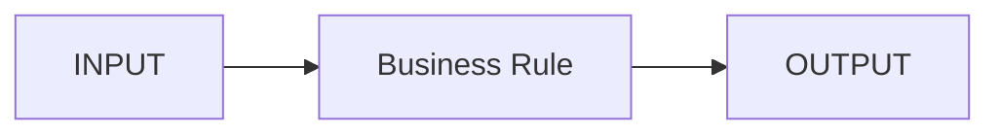

# Skill 記述標準

各サブシステムは原則として次の構造で管理する。

```text
skills/Sxx-<slug>/
  SKILL.md
  business-rules.md
  input-output.md
  interfaces.md
  reports/
  sources.md
```

## SKILL.md 必須章

1. Positioning / 責務
2. Scope / 対象
3. Out of Scope / 非対象
4. Key Concepts / 重要概念
5. Business Lifecycle / 業務ライフサイクル
6. Business Rules / 業務規則
7. Calculations / 計算
8. INPUT
9. OUTPUT
10. Internal Interfaces / 対内関係
11. External Interfaces / 対外関係
12. Reports / 帳票
13. Exceptions / 例外
14. Batch & Timing / タイミング
15. Accounting / 会計影響
16. Tax / 税影響
17. Test Viewpoints / テスト観点
18. Sources / 出典
19. Open Questions / 未確定

## Mermaid

状態遷移、データ流、サブシステム関係は Markdown 内に Mermaid で記載する。



## 成熟度

- `L0 Skeleton`: 役割と境界のみ
- `L1 Overview`: 主要業務・I/O・関係
- `L2 Rule`: 業務規則、計算、例外、出典
- `L3 Design-ready`: 項目・状態・帳票・IF・テスト観点まで
- `L4 Verified`: 複数一次情報 + 実案件Know-howで検証済み
