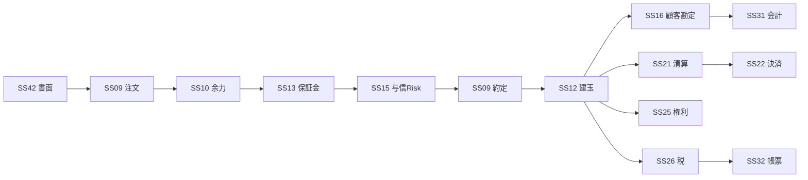
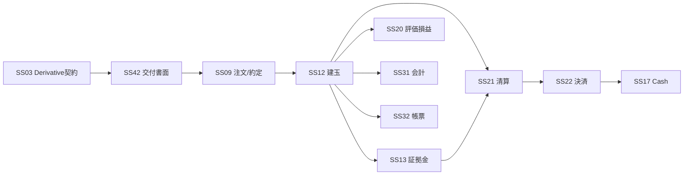
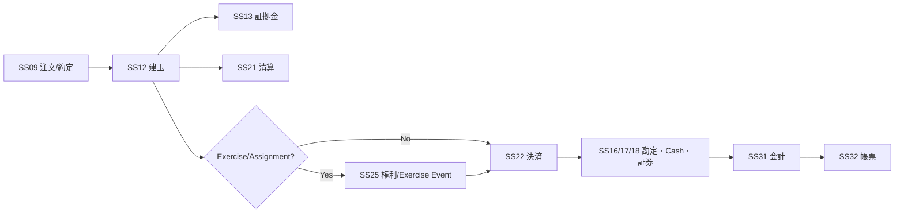
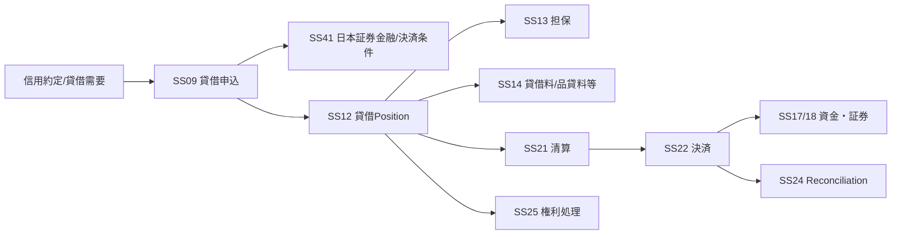
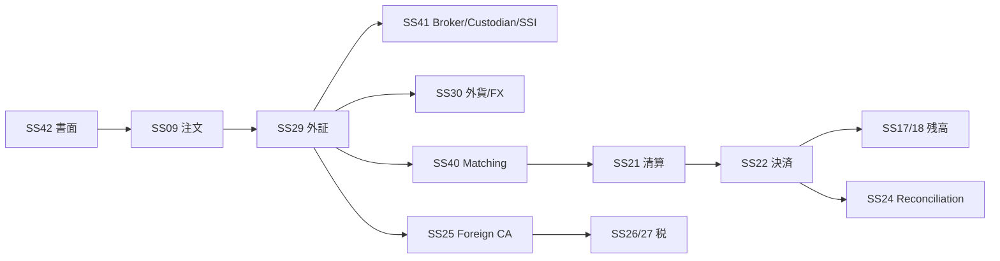
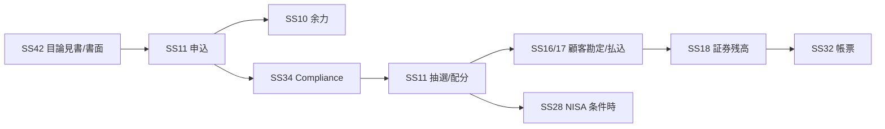
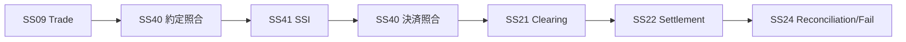

# Conditional Business E2E Validation v0.4

**Status:** Completed for Architecture Freeze Candidate  
**as-of:** 2026-09-08

## 1. 目的

Tier B Conditional領域について、既存の42業務サブシステムでEnd-to-End処理が閉じるかを確認する。

対象:

1. 信用取引
2. 先物
3. オプション
4. 貸借取引
5. 外国証券
6. 募集/売出
7. 機関投資家の約定/決済照合

結論: **新規サブシステム追加を必要とする重大Gapは検出しなかった。**

---

## 2. 信用取引

必要Authority:
- Order/Execution = SS09
- Buying Power = SS10
- Open Position = SS12
- Margin/Collateral = SS13
- Fee/Interest = SS14
- Credit/Risk = SS15
- Customer Ledger = SS16
- Settlement = SS21/22
- Corporate Action = SS25
- Tax = SS26

**判定: Closed**

---

## 3. 先物

JSCCはOSE等の上場先物・オプションについて債務引受、Margin計算/管理、決済を行う。Customer MarginはOpen Positionを基礎に管理される。

固有Rule:
- Initial Margin / Variation Margin
- Intraday/Emergency Margin
- Cash Settlement / Physical Delivery
- Final Settlement/SQ
- Position report/cutoff

これらは新SSではなく、SS12/13/21/22の `TR06 × PR08` Ruleとする。

公式参考:
- JSCC Futures/Options Clearing: https://www.jpx.co.jp/jscc/en/cash/futures/assumption-obligation/futuresclearing.html
- JSCC Margin on Futures and Options: https://www.jpx.co.jp/jscc/en/cash/futures/marginsystem/margin.html

**判定: Closed**

---

## 4. オプション

固有Rule:
- Premium
- Exercise/Assignment
- Expiration
- Cash/Physical Settlement
- Margin

SS25はCorporate Actionだけでなく、TR11として顧客意思を伴うExercise/Assignment Eventを扱うが、Option PositionのAuthorityはSS12に残す。

**判定: Closed**

---

## 5. 貸借取引

日本証券金融の貸借取引は制度信用取引の決済に必要な資金・株券を証券会社へ供給する外部業務であり、JSCCのDVP対象にも貸借取引等が含まれる。

重要Boundary:
- 貸借という取引 = TR08
- 貸借Position = SS12
- 担保 = SS13
- 貸借金利/品貸料等 = SS14
- Counterparty/SSI = SS41
- Clearing/Settlement = SS21/22

公式参考:
- 日本証券金融 貸借取引: https://www.jsf.co.jp/ja/business/r_taisyaku.html
- JSCC DVP: https://www.jpx.co.jp/jscc/seisan/genbutsu/acceptance_debt/dvp.html

**判定: Closed**

---

## 6. 外国証券

SS29はForeign-specific orchestration/recordを持つが、Order/Cash/Securities/Tax等のAuthorityは既存SSに残す。

**判定: Closed**

---

## 7. 募集・売出

SS11がApplication/Allocation Authority、SS42がDocument Authority。

**判定: Closed**

---

## 8. 機関投資家 約定/決済照合

JASDECの決済照合制度では約定照合、決済照合、SSI利用が独立した業務機能として存在するため、v0.4のSS40/41追加でBoundaryが閉じた。

公式参考:
- JASDEC 決済照合: https://faq.jasdec.com/faq/show/854
- JASDEC SSI: https://faq.jasdec.com/faq/show/862

**判定: Closed**

---

## 9. Conditional Coverage結論

| Domain | Result | New SS Needed |
|---|---|---|
| 信用 | Closed | No |
| 先物 | Closed | No |
| Option | Closed | No |
| 貸借 | Closed | No |
| 外国証券 | Closed | No |
| 募集/売出 | Closed | No |
| 機関投資家Matching | Closed | No |

**Architecture Gap = 0（本Review対象範囲）**

この結果、`SS01-SS42 + CS01-CS06` を引き続きArchitecture v1.0 Freeze Candidateとする。
