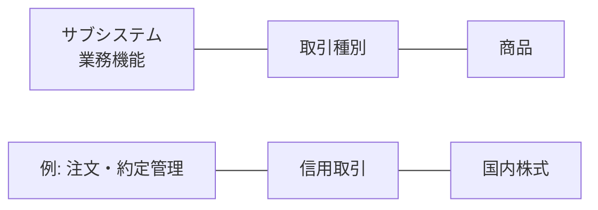

# 分類モデル v0.2

**as-of:** 2026-09-08

## 1. 基本原則

本リポジトリでは、以下の3軸を混在させない。

1. **サブシステム** = 業務機能・責務の単位
2. **取引種別** = 何をする取引か
3. **商品** = 何を取引するか

したがって、`顧客属性`、`余力`、`会計`、`注文・約定`、`譲渡益税`はサブシステムである。一方、`現物取引`、`信用取引`は取引種別、`株式`、`債券`、`投資信託`は商品である。

システム要件は原則として `サブシステム × 取引種別 × 商品` の組合せで整理する。

## 2. なぜ分離するか

`信用取引`という1取引は、注文・約定、余力、建玉、担保・保証金、顧客勘定、証券残高、清算、決済、権利、税、会計、帳票等の複数サブシステムを横断する。

同様に`投資信託`という1商品も、顧客/口座、注文、余力、金銭、残高、決済、権利、税、帳票等を横断する。

よって取引や商品をサブシステム名にすると、責務境界とINPUT/OUTPUTが崩れる。

## 3. 外国証券（外証）の扱い

`外国株式`・`外国債券`自体は商品軸である。ただし日本の証券会社では、海外市場、海外カストディ、SWIFT、多通貨、外国税、海外決済等の固有業務が大きいため、本参照モデルでは**外国証券業務管理（外証）**を業務サブシステムとして置く。

## 4. 共通系

外部接続、業務日付/バッチ、認証/権限、監査証跡、運用再処理、データ連携は、商品・取引を横断する**共通系サブシステム**として分離する。

## 5. 公開根拠

- NRI THE STAR: 口座開設、注文、決済、情報系、コンプライアンス、営業日報、財務会計を総合的に支援
  - https://www.nri.com/jp/service/solution/the_star.html
- NRI I-STAR/CORE: 約定管理、決済管理、証券残高管理、資金残高管理、顧客勘定、会計、対外報告を機能として列挙し、現物・先物・オプション・外国証券・債券・貸借等は取扱対象として別記
  - https://www.nri.com/jp/service/solution/i_star_core.html
- NRI I-STAR/GV: 参照マスター、取引、精算・決済、残高、コーポレートアクション、会計、例外、外部接続という機能分類
  - https://www.nri.com/jp/service/solution/i_star_gv.html
- JASDEC: 株式等、外国株券、一般債、短期社債、投資信託、DVP、決済照合など制度単位の外部インフラ
  - https://www.jasdec.com/rule/

> 本分類はNRIの非公開内部モジュール構成を示すものではなく、公開情報と日本証券業務実務から構成した参照モデルである。
