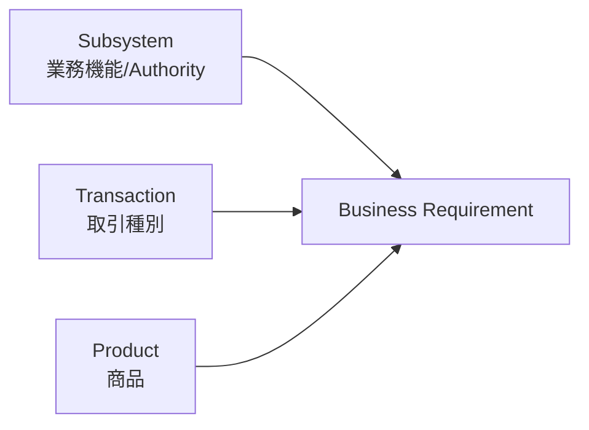

# 分類モデル v1.0

**Status:** Frozen  
**as-of:** 2026-09-08

## 1. 基本原則

本Repositoryでは、以下の3軸を混在させない。

1. **サブシステム (SS/CS)** = 業務機能・責務・Authorityの単位
2. **取引種別 (TR)** = 何をする取引か
3. **商品 (PR)** = 何を取引するか

したがって、`顧客属性`、`余力`、`会計`、`注文・約定`、`譲渡益税`はサブシステムである。一方、`現物取引`、`信用取引`は取引種別、`株式`、`債券`、`投資信託`は商品である。

システム要件は原則として `Subsystem × Transaction × Product` の交点で整理する。

例:

`SS09 注文・約定管理 × TR02 信用取引 × PR01 国内株式`

---

## 2. なぜ分離するか

`信用取引`という1取引は、注文・約定、余力、建玉、担保・保証金、顧客勘定、証券残高、清算、決済、権利、税、会計、帳票等の複数サブシステムを横断する。

同様に`投資信託`という1商品も、顧客/口座、交付書面、注文、余力、金銭、残高、決済、権利、税、帳票等を横断する。

よって、取引名や商品名をそのままサブシステムにすると責務境界、Data Authority、INPUT/OUTPUTが崩れる。

---

## 3. サブシステム追加基準

新SSを追加するのは、原則として次を満たす場合に限定する。

1. 複数商品・複数取引に共通する独立Business Authorityを持つ。
2. 独立したState/Lifecycle/Balance/Legal Evidenceを持つ。
3. 外部制度上独立した重要I/F、Matching、締め、報告責務を持つ。
4. 既存SSに入れると異質なAuthorityが混在する。

以下だけでは新SSを作らない。

- 商品が違う
- 取引名称が違う
- 物理Application/Serviceが別
- 実装Teamが別

---

## 4. 外国証券（外証）の扱い

`外国株式`・`外国債券`自体はProduct軸である。

ただし日本の証券会社では、海外市場、海外Custodian、SWIFT、多通貨、Foreign Tax、海外Settlement、Time Zone、Local Market Rule等の固有業務が横断的に大きいため、本参照モデルでは `SS29 外国証券業務管理（外証）` を独立した業務サブシステムとして置く。

SS29は外国商品固有情報/Orchestrationを担うが、Order/Cash/Securities/Tax等のAuthorityはSS09/17/18/26等から奪わない。

---

## 5. 共通系サブシステム

外部接続、業務日付/Batch、認証/権限、Audit Trail、運用Recovery、内部Data連携は、商品・取引を横断する共通責務として `CS01-CS06` に分離する。

- CS01 外部接続
- CS02 業務日付・Batch統制
- CS03 認証・権限管理
- CS04 監査証跡・操作履歴
- CS05 運用監視・Recovery・再処理
- CS06 Data連携・配信

---

## 6. Scope Tier

3軸分類とは別に、サブシステムの適用範囲を以下で分類する。

- Tier A Core
- Tier B Conditional Core
- Tier C Adjacent

Tierは重要度ではなく、Benchmark対象の証券取引基幹における責務境界を表す。詳細は `SCOPE_TIER_MODEL.md`。

---

## 7. v1.0 Freeze

Architecture v1.0では次をFreezeする。

- Business Subsystems: `SS01-SS42`
- Common Subsystems: `CS01-CS06`
- Transaction Catalog: `TR01-TR11`
- Product Catalog: `PR01-PR11`
- Requirement model: `SS/CS × TR × PR`

以後の追加・削除・責務境界変更はChange Requestとして管理する。

---

## 8. 公開根拠

- NRI THE STAR: https://www.nri.com/jp/service/solution/the_star.html
- NRI I-STAR/CORE: https://www.nri.com/jp/service/solution/i_star_core.html
- NRI I-STAR/GV: https://www.nri.com/jp/service/solution/i_star_gv.html
- JASDEC: https://www.jasdec.com/

NRI I-STAR/COREは、約定管理、決済管理、証券残高管理、資金残高管理、顧客勘定、会計、対外報告を機能として列挙し、現物・先物・Option・外国証券・債券・貸借等を取扱対象として別記している。この考え方を本分類の重要な公開Benchmarkとする。

> 本分類はNRIの非公開内部モジュール構成を示すものではなく、公開情報と日本証券業務実務から構成した独自参照モデルである。
