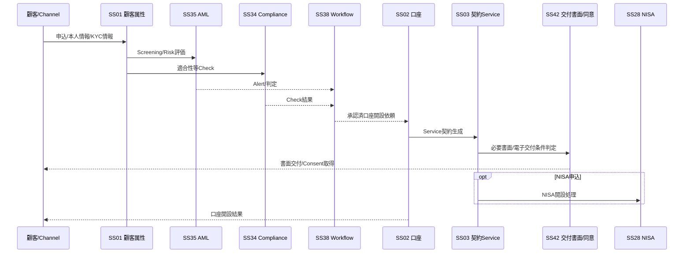
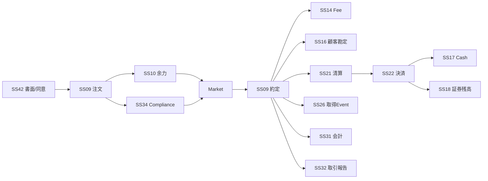
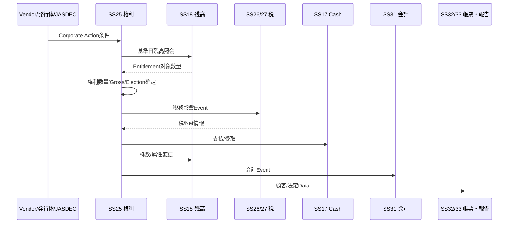
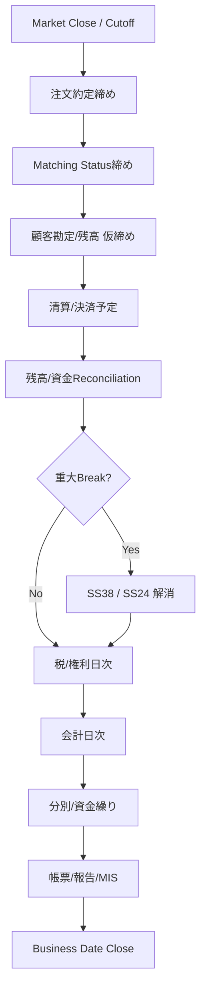
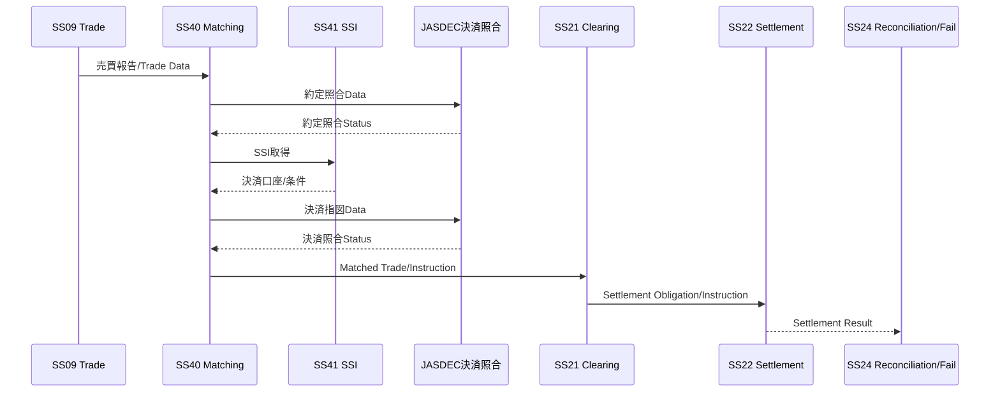

# End-to-End 業務フロー v0.4

**Status:** Draft for Architecture Freeze  
**as-of:** 2026-09-08

本書は、サブシステム境界が実際の証券業務ライフサイクルを切断していないか確認するためのE2Eフローである。

---

## 1. E2E Coverage一覧

| Flow ID | 業務フロー | 主なサブシステム |
|---|---|---|
| E2E-01 | 顧客口座開設・契約・書面同意 | SS01,02,03,04,28,34,35,38,42,CS01 |
| E2E-02 | 国内株式 現物買付 | SS05-10,14-18,20-22,26,31,32,34,41,42,CS01 |
| E2E-03 | 国内株式 現物売却 | SS05-10,14,16-22,26,31,32,34,41,42,CS01 |
| E2E-04 | 国内株式 信用新規→返済 | SS05-10,12-18,20-22,25-27,31,32,34,41,42,CS01 |
| E2E-05 | IPO/PO・募集配分 | SS01-08,10,11,16-18,26,28,31,32,34,38,41,42 |
| E2E-06 | 投資信託 買付→分配→解約 | SS01-10,14,16-18,20,22,25-28,31,32,41,42,CS01 |
| E2E-07 | 債券 買付→利金→償還 | SS05-10,14,16-18,20-22,25,27,31,32,41,42,CS01 |
| E2E-08 | 株式 Corporate Action | SS05-08,18,20,23,25-28,31-33,41,CS01 |
| E2E-09 | 他社移管 入庫/出庫 | SS01-05,18,19,23,24,26,28,31,32,41,CS01 |
| E2E-10 | 外国株式 買付→海外決済 | SS01-10,14,16-18,20-22,24-27,29,30-32,40,41,42,CS01 |
| E2E-11 | 特定口座 年間税務締め | SS01-08,18-20,25-28,31-33,CS02 |
| E2E-12 | 日次締め・照合・会計 | SS09-42,CS02,CS04,CS05,CS06 |
| E2E-13 | 決済Fail→解消 | SS16-24,31,38-41,CS01,CS05 |
| E2E-14 | 機関投資家 約定→約定照合→決済照合→決済 | SS09,16,21-24,31,40,41,CS01 |

---

## 2. E2E-01 顧客口座開設・契約・書面同意



Architecture Point:
- Customer Authority = SS01
- Account Authority = SS02
- Contract Authority = SS03
- Document Version / Delivery Evidence / Consent Authority = SS42

---

## 3. E2E-02 国内株式 現物買付



SS41は市場/決済先/口座等のReferenceを提供する。

---

## 4. E2E-03 国内株式 現物売却

- SS18で売却可能数量を確認/拘束
- SS10で余力/拘束管理
- SS09で注文/約定
- SS26で税務取得価額割当・譲渡損益・源泉徴収/還付
- SS21/22で清算/決済
- SS17/18でCash/証券残高更新
- SS31/32へ会計/帳票Event

---

## 5. E2E-04 信用新規→返済

信用取引は取引種別であり独立サブシステムではない。

### 新規

`SS42取引前要件 → SS09注文 → SS10余力 → SS13保証金 → SS15与信 → 約定 → SS12建玉 → SS16顧客勘定 → SS21/22清算決済`

### 保有中

- SS12: 建玉/期日
- SS13: 保証金/代用/追証
- SS14: 金利/品貸料等
- SS20: 評価損益
- SS25: 権利影響

### 返済

`返済注文 → 約定 → 建玉特定/減算 → 損益/費用 → 清算決済 → 税/会計/帳票`

日本証券金融等との制度信用貸借はCS01を経由し、取引種別TR08として既存SSへRuleを追加する。

---

## 6. E2E-05 募集・売出・配分

```text
SS42 書面/目論見書/同意
  ↓
SS11 申込受付
  ↓
SS10 申込余力/資金拘束
  ↓
SS34 適合性・制限Check
  ↓
SS11 抽選/配分
  ↓
SS16/17 顧客勘定・払込
  ↓
SS18 証券残高
  ↓
SS26/28 税・NISA
  ↓
SS31/32 会計・帳票
```

---

## 7. E2E-06 投資信託

- SS05: 商品属性
- SS07: 基準価額
- SS42: 目論見書/交付要件/同意証跡
- SS09: 注文
- SS10: 余力
- SS14: 手数料
- SS16/17: 顧客勘定/Cash
- SS18: 残高
- SS22: 受渡
- SS25: 分配/償還
- SS26/27/28: 税/NISA
- SS32: 帳票

商品固有の外部委託会社/Fund I/FはCS01。

---

## 8. E2E-07 債券

主な固有Event:

- 買付/売却
- 経過利子
- 利金
- 償還
- 条件変更/Default

機能AuthorityはSS09/14/16-22/25/27/31/32へ分解し、Counterparty/Settlement conditionはSS41とする。

---

## 9. E2E-08 Corporate Action



---

## 10. E2E-09 他社移管

### 入庫

`他社/JASDEC → CS01 → SS19 → SS41相手先/決済条件確認 → SS23 → SS18 → SS26取得価額 → SS28(該当時) → SS24照合`

### 出庫

`顧客依頼 → SS38承認 → SS19 → SS18拘束/減算 → SS23/CS01外部振替 → SS24結果照合 → SS26取得価額引継Data`

---

## 11. E2E-10 外国株式

```text
SS42 取引前書面
 ↓
SS09 注文
 ↓
SS29 外証固有情報
 ↓
SS41 Counterparty / Custody / SSI
 ↓
CS01 → 海外市場/Broker
 ↓
Execution
 ↓
SS29 + SS09
 ↓
SS30 FX/外貨
 ↓
SS40 Matching(必要時)
 ↓
SS21/22 + Global Custody
 ↓
SS17/18 残高
 ↓
SS25 外国CA
 ↓
SS26/27 税
 ↓
SS31/32 会計・帳票
```

Foreign Settlement FailはSS24で管理する。

---

## 12. E2E-11 特定口座 年間税務締め

1. 年内取得/譲渡Event完全性確認
2. 訂正/取消/移管/Corporate Action反映確認
3. SS27から配当受入対象取得
4. 損益通算/徴収/還付確定
5. SS26 Annual Tax Ledger締め
6. SS32 特定口座年間取引報告書
7. SS33 税務署提出Data
8. 訂正時は再計算/再発行/再提出Version管理

---

## 13. E2E-12 日次締め



CS02は順序・依存・締めを統制し、各業務計算はAuthority SSが行う。

---

## 14. E2E-13 Settlement Fail

1. SS22で未決済/Fail検知
2. SS24でFail Case生成
3. SS40 Matching状態、SS41 SSI、外部Status/残高を確認
4. 必要に応じSS38で手動承認/補正
5. SS39で資金影響再計算
6. CS01で再指図/再送
7. Settlement完了後SS16/17/18/31へ確定反映
8. CS04に操作/補正履歴を保存

---

## 15. E2E-14 機関投資家 約定→決済照合



重要:
- Trade AuthorityはSS09
- Matching AuthorityはSS40
- SSI AuthorityはSS41
- Settlement AuthorityはSS22
- Break/Fail AuthorityはSS24

---

## 16. Architecture Review観点

- [ ] 各E2EでAuthority不明のBusiness Objectがないか
- [ ] 1つの機能が商品名/取引名で重複していないか
- [ ] 取引前文書→注文→約定→清算→決済→残高→税/会計/帳票がつながるか
- [ ] MatchingとReconciliationを混同していないか
- [ ] SSI/決済口座Referenceと個別Settlement Instructionを混同していないか
- [ ] OnlineからEODまでData lineageが切れないか
- [ ] 訂正/取消/Fail/再送がE2Eで閉じるか
