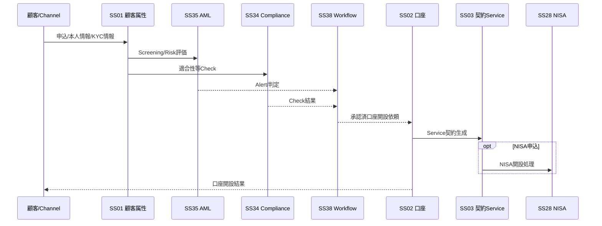
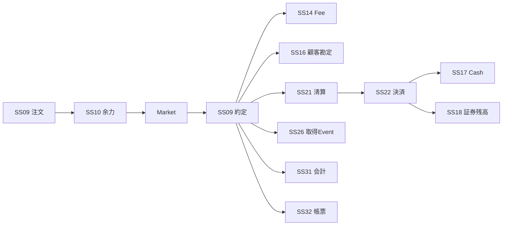
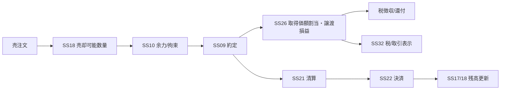
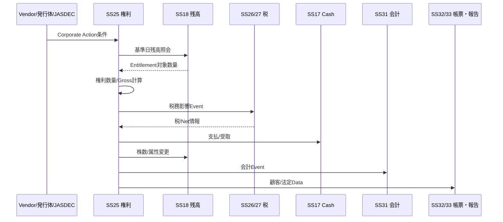
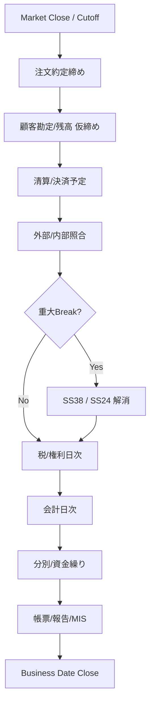

# End-to-End 業務フロー v0.3

**Status:** Draft for Architecture Review  
**as-of:** 2026-09-08

本書は、サブシステム境界が実際の証券業務ライフサイクルを切断していないか確認するためのE2Eフローである。

---

## 1. E2E Coverage一覧

| Flow ID | 業務フロー | 主なサブシステム |
|---|---|---|
| E2E-01 | 顧客口座開設 | SS01,02,03,04,28,34,35,38,CS01 |
| E2E-02 | 国内株式 現物買付 | SS05-10,14-18,20-22,26,31,32,34,CS01 |
| E2E-03 | 国内株式 現物売却 | SS05-10,14,16-22,26,31,32,34,CS01 |
| E2E-04 | 国内株式 信用新規→返済 | SS05-10,12-18,20-22,25-27,31,32,34,CS01 |
| E2E-05 | IPO/PO・募集配分 | SS01-08,10,11,16-18,26,28,31,32,34,38 |
| E2E-06 | 投資信託 買付→分配→解約 | SS01-10,14,16-18,20,22,25-28,31,32,CS01 |
| E2E-07 | 債券 買付→利金→償還 | SS05-10,14,16-18,20-22,25,27,31,32,CS01 |
| E2E-08 | 株式 Corporate Action | SS05-08,18,20,23,25-28,31-33,CS01 |
| E2E-09 | 他社移管 入庫/出庫 | SS01-05,18,19,23,24,26,28,31,32,CS01 |
| E2E-10 | 外国株式 買付→海外決済 | SS01-10,14,16-18,20-22,24-27,29,30-32,CS01 |
| E2E-11 | 特定口座 年間税務締め | SS01-08,18-20,25-28,31-33,CS02 |
| E2E-12 | 日次締め・照合・会計 | SS09-39,CS02,CS04,CS05,CS06 |
| E2E-13 | 決済Fail→解消 | SS16-24,31,38,39,CS01,CS05 |

---

## 2. E2E-01 顧客口座開設



**確認ポイント**

- 顧客属性AuthorityはSS01、口座AuthorityはSS02
- AML/Complianceが口座そのものを生成しない
- 手動審査はSS38を介して原Authorityへ結果を返す

---

## 3. E2E-02 国内株式 現物買付

### 主要ステップ

1. 注文受付
2. 契約/銘柄/市場/取扱可否確認
3. 余力照会・資金拘束
4. Compliance/取引Risk確認
5. 市場発注
6. 約定受信
7. 手数料計算
8. 顧客勘定生成
9. 清算債務生成
10. 決済Instruction生成
11. 受渡日にCash/証券残高更新
12. 税務取得Event生成
13. 会計Event生成
14. 取引報告書生成



---

## 4. E2E-03 国内株式 現物売却

買付との差分:

- SS18で売却可能数量を確認/拘束
- SS26で税務取得価額を割当
- 譲渡価額 - 取得費 - 譲渡費用から譲渡損益計算
- 源泉徴収口座では徴収/還付がSS17/16へ連携
- 受渡日に証券減算/Cash増加



---

## 5. E2E-04 信用新規→返済

信用取引は取引種別であり、独立Systemではない。

### 新規

`SS09 注文 → SS10 余力 → SS13 保証金 → SS15 与信 → 約定 → SS12 建玉生成 → SS16 顧客勘定 → SS21/22 清算決済`

### 保有中

- SS12: 建玉/期日
- SS13: 保証金/代用/追証
- SS14: 金利/品貸等諸経費
- SS20: 評価損益
- SS25: 権利影響

### 返済

`返済注文 → 約定 → 建玉特定/減算 → 損益/費用 → 清算決済 → 税/会計/帳票`

**Architecture Check:** SS12とSS18を混同しない。建玉と預り株は異なるAuthority。

---

## 6. E2E-05 募集・売出・配分

```text
顧客/営業
  ↓
SS11 申込受付
  ↓
SS10 申込余力/資金拘束
  ↓
SS34 適合性・制限Check
  ↓
SS11 抽選/配分
  ↓
SS16 顧客勘定 / SS17 払込
  ↓
SS18 証券残高
  ↓
SS26/28 税・NISA属性
  ↓
SS31/32 会計・帳票
```

---

## 7. E2E-06 投資信託

商品は投信だが、機能は既存SSを横断する。

- 商品属性: SS05
- 基準価額: SS07
- 注文: SS09
- 余力: SS10
- 手数料: SS14
- 顧客勘定/Cash: SS16/17
- 残高: SS18
- 受渡: SS22
- 分配/償還: SS25
- 税: SS26/27/28
- 帳票: SS32

投信固有の外部委託会社/Fund関連I/FはCS01で処理する。

---

## 8. E2E-07 債券

債券も商品軸。

主な固有イベント:

- 買付/売却
- 経過利子等の取引条件
- 利金
- 償還
- デフォルト/条件変更等

機能Authorityは注文、勘定、残高、決済、権利、税、会計へ分解する。

---

## 9. E2E-08 Corporate Action



対象例:

- 配当
- 利金
- 償還
- 株式分割/併合
- 合併/株式交換
- 新株予約権/割当
- 資本払戻し
- TOB関連

---

## 10. E2E-09 他社移管

### 入庫

`他社/JASDEC → CS01 → SS19 → SS23確認 → SS18残高 → SS26取得価額 → SS28 NISA属性(該当時) → SS24照合`

### 出庫

`顧客依頼 → SS38承認 → SS19 → SS18拘束/減算 → SS23/CS01外部振替 → SS24結果照合 → SS26取得価額引継Data`

---

## 11. E2E-10 外国株式

```text
Channel
 ↓
SS09 注文
 ↓
SS29 外証固有情報付加
 ↓
CS01 → 海外市場/Broker
 ↓
Foreign Execution
 ↓
SS29 + SS09
 ↓
SS30 FX/外貨
 ↓
SS21/22 + 海外Custody
 ↓
SS17/18 残高
 ↓
SS25 外国CA
 ↓
SS26/27 税
 ↓
SS31/32 会計・帳票
```

Foreign Settlement FailはSS24で管理する。

---

## 12. E2E-11 特定口座 年間税務締め

1. 年内全取得/譲渡EventがSS26へ反映済みか確認
2. 約定訂正/取消/移管/Corporate Action反映確認
3. 配当受入対象をSS27から取得
4. 損益通算/徴収/還付確定
5. SS26の年間Tax Ledgerを締める
6. SS32: 顧客向け特定口座年間取引報告書
7. SS33: 税務署向け提出Data
8. 訂正が発生した場合、再計算/再発行/再提出Versionを管理

---

## 13. E2E-12 日次締め



CS02は順序・依存・締めを統制し、各業務計算はAuthority SSが行う。

---

## 14. E2E-13 Settlement Fail

1. SS22で未決済/Fail検知
2. SS24でBreak/Fail Case生成
3. 外部Status/残高/Instructionを照合
4. 必要に応じSS38で手動承認/補正
5. SS39で資金影響を再計算
6. CS01で再指図/再送
7. Settlement完了後SS16/17/18/31へ確定反映
8. CS04に操作/補正履歴を保存

---

## 15. Architecture Review観点

- [ ] 各E2EフローでAuthority不明の業務情報がないか
- [ ] 1つの機能が商品名/取引名で重複していないか
- [ ] OnlineからEODまでDataが途切れないか
- [ ] 訂正/取消/Fail/再処理経路があるか
- [ ] 税/会計/帳票が後付けではなくE2Eに含まれているか
- [ ] 外国証券だけ例外的に別体系になりすぎていないか
