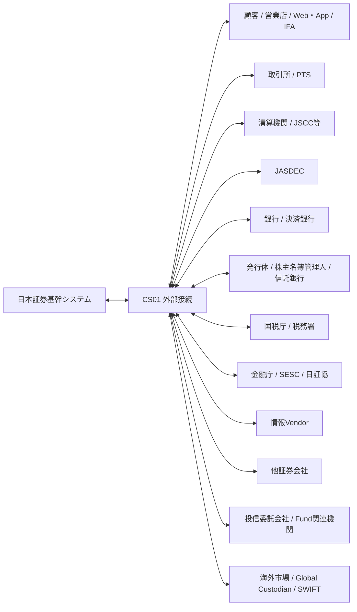

# 外部関係マップ v0.3

**Status:** Draft for Architecture Review  
**as-of:** 2026-09-08

本書は日本証券基幹システムと外部主体との主要業務関係を整理する。具体的なProtocol/電文/File仕様は各サブシステムおよびCS01で定義する。

---

## 1. 外部全体図

---

## 2. 外部主体別関係

| External Party | 主に関係するSS | Inbound to Core | Outbound from Core | 主なタイミング |
|---|---|---|---|---|
| 顧客/営業店/Web/App/IFA | SS01-04,09-11,17,19,28,30,32,38 | 顧客申込, 注文, 入出金/移管依頼, 各種選択 | 受付結果, 約定, 余力, 残高, 帳票, Alert | Online/随時 |
| 取引所/PTS | SS05-07,09,34 | 市場情報, 注文Ack, 約定, 取消/訂正結果 | 注文, 訂正, 取消 | Online/市場時間 |
| JSCC等清算機関 | SS21,22,24,39 | 清算結果, Netting, 決済予定, Margin/資金関連 | 約定/清算対象, 決済関連指図/確認 | 日中/日次 |
| JASDEC | SS18,19,22,23,24,25,33 | 口座/残高/振替/決済/権利関連Data | 振替/決済/各種届出・照合 | 日中/Batch |
| 銀行/決済銀行 | SS17,22,30,39 | 入金, 出金結果, 口座残高, FX/資金結果 | 振込/資金決済指図, 資金移動 | Online/日中/締め |
| 発行体/株主名簿管理人/信託銀行 | SS25,27,32 | 権利条件, 配当/利金/償還, 支払情報 | 権利関連確認/必要Data | Event/基準日/支払日 |
| 国税庁/税務署 | SS26-28,33 | 制度/様式/受付結果等 | 特定口座/NISA/法定調書等 | 年次/制度Event |
| 金融庁/SESC/日証協等 | SS33-36 | 制度/報告仕様/照会等 | 監督/業界報告, 必要データ | 日次/月次/随時/年次 |
| 情報Vendor | SS05-08,25 | 銘柄, 時価, FX, Rate, Corporate Action等 | 確認/Subscription等 | Streaming/日次 |
| 他証券会社 | SS19,24,26 | 移管入庫, 取得価額/移管情報等 | 移管出庫, 引継情報 | 随時/Batch |
| 投信委託会社/Fund関連機関 | SS05,07,09,11,18,22,25 | 基準価額, 商品属性, 約定/受渡/分配関連 | 注文/解約等の業務Data | 日次/締め |
| 海外市場/Global Custodian/SWIFT | SS29,30,22,24,25 | Foreign Execution, Settlement, Position, CA, Tax | Foreign Order/Settlement/FX関連 | Global Market/日次 |

---

## 3. 外部接続で必須となる共通属性

CS01は通信を単純中継するだけでなく、以下を共通的に保持/管理する。

| 属性 | 内容 |
|---|---|
| Interface ID | 外部I/F識別子 |
| Business Owner | Authorityサブシステム |
| Counterparty | 外部主体 |
| Business Object | Order, Execution, Settlement等 |
| Direction | IN / OUT / BOTH |
| Channel | API, FIX, File, MQ, SFTP等 |
| Session/Connection | 接続単位 |
| Business Date | 業務日 |
| Sequence | 順序性がある場合の番号 |
| Correlation ID | Request/Response対応 |
| Idempotency Key | 重複防止Key |
| ACK/NACK | 技術/業務応答 |
| Cutoff | 締切 |
| Retry/Replay | 再送・再配信 |
| Reconciliation | 後続照合方法 |
| Retention | 電文/File保存期間 |
| Security | 暗号化/署名/Access制御 |

---

## 4. 外部関係のAuthority原則

### 4.1 Market

- 注文/約定の業務Authority: SS09
- CS01はSession/Protocol/送受信をAuthorityとする
- Marketから受信したExecutionをCS01だけに留めない

### 4.2 Clearing / Settlement

- 清算債権債務: SS21
- 受渡Instruction/Status: SS22
- JASDEC口座構造: SS23
- 不一致/Fail: SS24

### 4.3 Bank

- 顧客金銭残高: SS17
- 決済資金の受渡: SS22
- 外貨/為替: SS30
- 会社全体の資金繰り: SS39

### 4.4 Tax / Regulatory

- 税計算: SS26/27/28
- 外部提出物: SS33
- 対客税務帳票: SS32
- CS01は提出/受領Transportを担当

---

## 5. 対外I/Fの設計原則

1. **Technical ACKとBusiness ACKを分離する。**
2. 外部受信Dataを再処理しても重複業務Eventを作らない。
3. File再送・電文Replay・Sequence Gapに対応する。
4. 外部Cutoffと社内業務日付を明示的に管理する。
5. 外部Data訂正時は原EventとのLineageを残す。
6. 日中成功だけでなく、EOD照合で完全性を保証する。
7. 外部System障害時に手動補正/代替手段/Recovery Pointを定義する。

---

## 6. 公開参照

- JPX: https://www.jpx.co.jp/
- JSCC: https://www.jpx.co.jp/jscc/
- JASDEC: https://www.jasdec.com/
- 国税庁: https://www.nta.go.jp/
- 金融庁: https://www.fsa.go.jp/
- 証券取引等監視委員会: https://www.fsa.go.jp/sesc/
- 日本証券業協会: https://www.jsda.or.jp/

個別外部仕様は、各外部機関の正式規程・仕様書をAuthorityとして別途整理する。
