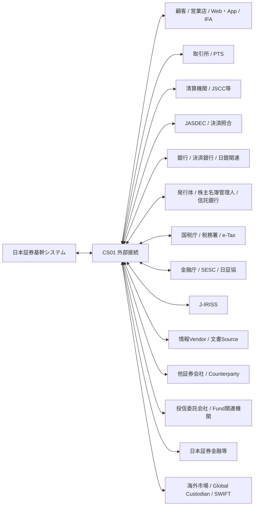
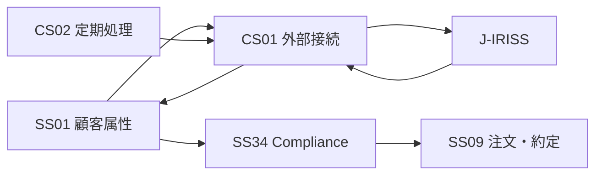

# 外部関係マップ v0.4

**Status:** Draft for Architecture Freeze  
**as-of:** 2026-09-08

本書は日本証券基幹システムと外部主体との主要業務関係を整理する。具体的なProtocol/電文/File仕様はArchitecture Freeze後、各サブシステムおよびCS01で定義する。

---

## 1. 外部全体図



---

## 2. 外部主体別関係

| External Party | 主に関係するSS | Inbound to Core | Outbound from Core | 主なタイミング |
|---|---|---|---|---|
| 顧客/営業店/Web/App/IFA | SS01-04,09-11,17,19,28,30,32,38,42 | 顧客申込, 注文, 入出金/移管依頼, 各種選択/同意 | 受付結果, 約定, 余力, 残高, 交付書面, 帳票, Alert | Online/随時 |
| 取引所/PTS | SS05-09,34,41 | 市場情報, 注文Ack, 約定, 取消/訂正結果, Venue属性 | 注文, 訂正, 取消 | Online/市場時間 |
| JSCC等清算機関 | SS21,22,24,39,41 | 清算結果, Netting, 決済予定, Margin/資金関連 | 清算対象/確認, 決済関連Data | 日中/日次 |
| JASDEC振替制度 | SS18,19,22,23,24,25,41 | 口座/残高/振替/決済/権利関連Data | 振替/決済/各種届出 | 日中/Batch |
| JASDEC決済照合 | SS09,22,24,40,41 | 約定照合結果, 決済照合結果, Matching Status | 売買報告Data, 決済指図Data等 | Real-time/日中 |
| 銀行/決済銀行/日銀関連 | SS17,22,30,39,41 | 入金, 出金結果, 口座残高, FX/資金結果 | 振込/資金決済指図, 資金移動 | Online/日中/締め |
| 発行体/株主名簿管理人/信託銀行 | SS25,27,32,41,42 | 権利条件, 配当/利金/償還, 支払情報, 文書/目論見書Source | 権利関連Data/確認 | Event/基準日/支払日 |
| 国税庁/税務署/e-Tax | SS26-28,33 | 制度/様式/受付結果/受信通知等 | 特定口座/NISA/法定調書等の電子提出 | 年次/制度Event/提出時 |
| 金融庁/SESC/日証協等 | SS33-36,42 | 制度/報告仕様/自主規制/書面要件 | 監督/業界報告, 必要Data | 日次/月次/随時/年次 |
| J-IRISS | SS01,34,CS01,CS02 | 顧客情報照合結果 | 顧客照合用Data | 少なくとも年1回以上/必要時 |
| 情報Vendor | SS05-08,25,41 | 銘柄, 時価, FX, Rate, Corporate Action, Counterparty属性等 | 確認/Subscription等 | Streaming/日次 |
| 他証券会社/Counterparty | SS09,19,24,40,41 | 約定/決済情報, 移管入庫, 取得価額等 | 売買報告, 決済情報, 移管出庫/引継 | 随時/Batch |
| 投信委託会社/Fund関連機関 | SS05,07,09,11,18,22,25,40-42 | 基準価額, 商品属性, 約定/受渡/分配/目論見書 | 注文/解約/決済関連Data | 日次/締め |
| 日本証券金融等 | SS05,09,12-14,18,21,22,25,41 | 貸借条件, 制限, 品貸料率, 貸借結果等 | 貸借申込/決済関連Data | 日次/引け後/随時 |
| 海外市場/Global Custodian/SWIFT | SS29,30,22,24,25,40,41 | Foreign Execution, Settlement, Position, CA, Tax, SSI | Foreign Order/Settlement/FX関連 | Global Market/日次 |

---

## 3. J-IRISSの位置づけ

J-IRISSはサブシステムではなく、インサイダー取引未然防止のために利用する外部業界インフラとして扱う。



責務:

- SS01: 顧客の内部者属性/内部者登録情報の社内Authority
- SS34: 注文時の内部者Check/Compliance Rule
- CS01: J-IRISS照合Transport
- CS02: 年次等の定期照合Scheduling

日本証券業協会の公開資料では、協会員はJ-IRISSと自社顧客情報を**年1回以上照合**し、その結果を踏まえて内部者登録カードを更新する制度となっている。

---

## 4. e-Taxの位置づけ

e-Taxは税務計算Systemではなく、法定調書等を税務当局へ電子提出する外部Endpointとして扱う。

```text
SS26/27/28 税務Authority
       ↓
SS33 法定提出Data / Version
       ↓
CS01 Transport
       ↓
e-Tax
       ↓
受付結果
       ↓
CS01 → SS33
```

- 税計算: SS26/27/28
- 提出Data/提出Version/受付状態: SS33
- Transport/再送/受信: CS01

---

## 5. 外部接続で必須となる共通属性

CS01は通信を単純中継するだけでなく、以下を共通的に保持/管理する。

| 属性 | 内容 |
|---|---|
| Interface ID | 外部I/F識別子 |
| Business Owner | Authorityサブシステム |
| Counterparty | 外部主体 |
| Business Object | Order, Execution, Match, Settlement, TaxSubmission等 |
| Direction | IN / OUT / BOTH |
| Channel | API, FIX, File, MQ, SFTP等 |
| Session/Connection | 接続単位 |
| Business Date | 業務日 |
| Sequence | 順序性がある場合の番号 |
| Correlation ID | Request/Response対応 |
| Idempotency Key | 重複防止Key |
| ACK/NACK | 技術/業務応答 |
| Cutoff | 締切 |
| Retry/Replay | 再送・再配信 |
| Reconciliation | 後続照合方法 |
| Retention | 電文/File保存期間 |
| Security | 暗号化/署名/Access制御 |

---

## 6. 外部関係のAuthority原則

### 6.1 Market

- 注文/約定: SS09
- 執行先/ルーティング結果: SS09
- 最良執行Rule遵守: SS34
- Counterparty/Venue Reference: SS41
- Transport/Session: CS01

### 6.2 Matching / Settlement

- 自社約定: SS09
- 約定/決済Matching Status: SS40
- SSI/決済口座Reference: SS41
- 清算債権債務: SS21
- 受渡Instruction/Status: SS22
- JASDEC口座構造: SS23
- 残高/資金Break/Fail: SS24

### 6.3 Bank

- 顧客金銭残高: SS17
- 決済資金受渡: SS22
- 外貨/為替: SS30
- 会社全体資金繰り: SS39
- Bank/Account/SSI Reference: SS41

### 6.4 Documents

- 契約前/契約時書面Version・交付証跡・Consent: SS42
- 取引後/期間帳票: SS32
- 法定提出物: SS33

### 6.5 Tax / Regulatory

- 税計算: SS26/27/28
- 外部提出物/提出状態: SS33
- 対客税務帳票: SS32
- e-Tax Transport/受付受信: CS01

### 6.6 Insider / J-IRISS

- 顧客内部者属性: SS01
- Insider Trade Rule/Alert: SS34
- J-IRISS照合Transport: CS01
- 定期照合Trigger: CS02

---

## 7. 対外I/Fの設計原則

1. Technical ACKとBusiness ACKを分離する。
2. 外部受信Dataを再処理しても重複Business Eventを作らない。
3. File再送・電文Replay・Sequence Gapに対応する。
4. 外部Cutoffと社内Business Dateを明示的に管理する。
5. 外部Data訂正時は原EventとのLineageを残す。
6. 日中成功だけでなくEOD Reconciliationで完全性を保証する。
7. Matching StatusとSettlement Statusを混同しない。
8. SSI/口座/文書はeffective date付きVersionとして扱う。
9. 定期外部照合（J-IRISS等）は最終実施日/結果/差分反映証跡を持つ。
10. 税務/当局電子提出は提出Version、再提出、受付結果を保持する。
11. 外部System障害時の手動補正/代替手段/Recovery Pointを定義する。

---

## 8. 公開参照

- JPX/JSCC: https://www.jpx.co.jp/jscc/
- JASDEC: https://www.jasdec.com/
- JASDEC 決済照合: https://faq.jasdec.com/faq/show/854
- JASDEC SSI: https://faq.jasdec.com/faq/show/862
- 国税庁/e-Tax: https://www.e-tax.nta.go.jp/
- 金融庁: https://www.fsa.go.jp/
- SESC: https://www.fsa.go.jp/sesc/
- 日本証券業協会: https://www.jsda.or.jp/
- J-IRISS: https://www.jsda.or.jp/anshin/j-iriss/
- 日本証券金融: https://www.jsf.co.jp/

個別外部仕様は各外部機関の正式規程・接続仕様書をAuthorityとして別途整理する。
