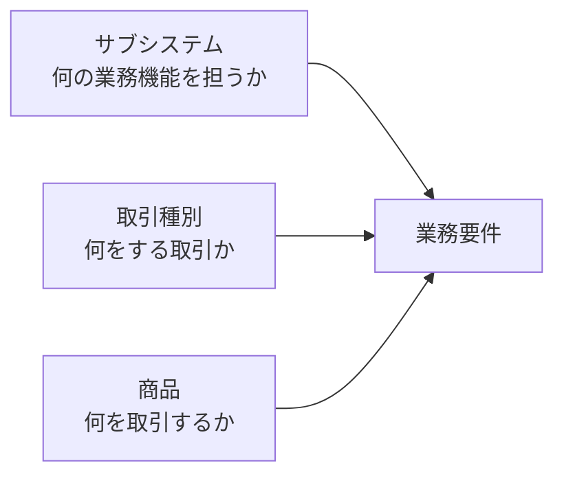
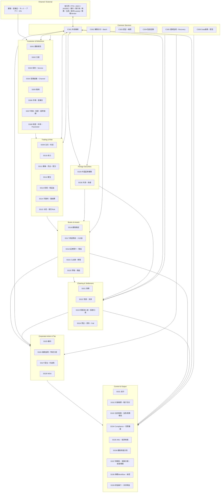
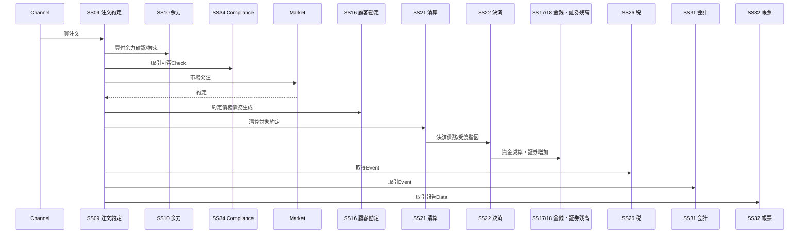

# 日本証券基幹システム 総体設計 v0.3

**Status:** Draft for Architecture Review  
**as-of:** 2026-09-08  
**Benchmark:** NRI THE STAR クラスの日本証券会社向け基幹/バックオフィス機能を想定した独自参照モデル

> 本設計は公開一次情報と日本証券業務の一般的な実務構造から作成した参照モデルであり、NRI THE STAR の非公開内部構成・内部名称・データモデルを示すものではない。

---

## 1. 設計目的

本プロジェクトでは、個別業務を先に書き始めるのではなく、まず日本の総合証券会社の基幹システムを一つ設計するとした場合の**全体構造**を確定する。

総体設計で確定するもの:

1. サブシステム境界
2. 取引種別・商品との分類境界
3. サブシステム間の責務分担
4. 主要な内部I/F
5. 主要な外部I/F
6. 業務データのAuthority（正本）
7. 代表的なEnd-to-End業務フロー
8. 共通基盤の責務

総体設計確定後に、各サブシステムを `L2/L3` の詳細Skillへ展開する。

---

## 2. 3軸分類

例:

`SS09 注文・約定管理 × TR02 信用取引 × PR01 国内株式`

この3軸を混在させない。

---

## 3. システム境界

### 3.1 本参照モデルの内側

- 顧客・口座・契約
- 基準情報/マスター
- 注文・約定等の取引処理
- 余力/建玉/担保/与信
- 顧客勘定/金銭/証券残高
- 清算/受渡/保振/照合
- 権利/税務/NISA
- 外国証券/外貨
- 会計/帳票/法定報告
- コンプライアンス/AML/分別管理
- 情報系/事務Workflow/資金繰り
- 外部接続/バッチ/権限/監査/運用/データ連携

### 3.2 原則として外側に置くもの

- 顧客向けWeb/スマホUIそのもの
- 営業店端末UIそのもの
- 取引所/PTS
- JSCC等の清算機関
- JASDEC
- 銀行/日銀決済網
- 発行体/株主名簿管理人/信託銀行
- 国税庁/税務署
- 金融庁/SESC/日証協
- 情報ベンダー
- 海外市場/グローバルカストディ/SWIFT
- 全社人事/給与等の非証券基幹システム

外側のシステムとの業務契約は `CS01 外部接続` を経由して各Authorityサブシステムへ接続する。

---

## 4. 機能レイヤー

---

## 5. サブシステム群と主責務

| Domain | Subsystems | 主な責務 |
|---|---|---|
| 顧客・口座・営業 | SS01-SS04 | 誰が、どの口座・契約・チャネルで取引できるか |
| 基準情報 | SS05-SS08 | 何を、いつ、どの制度/Rateで処理するか |
| 取引・Risk | SS09-SS15 | 注文から約定、余力、建玉、担保、手数料、与信 |
| 顧客勘定・資産 | SS16-SS20 | 顧客の債権債務、金銭、証券、移管、評価損益 |
| 清算・決済 | SS21-SS24 | 約定後の清算、受渡、保振口座、照合/Fail |
| 権利・税務 | SS25-SS28 | Corporate Action、譲渡益税、配当税、NISA |
| 外国証券 | SS29-SS30 | 海外市場/Custody固有処理、多通貨/為替 |
| 会計・帳票・統制 | SS31-SS39 | 会計、帳票、法定報告、審査、AML、分別、MIS、事務、資金繰り |
| 共通 | CS01-CS06 | 接続、Batch、権限、監査、Recovery、内部Data連携 |

---

## 6. 基本業務チェーン

### 6.1 国内株式 現物買付

### 6.2 国内株式 現物売却

売却では SS18 の売却可能数量、SS10 の拘束、SS26 の取得価額/譲渡損益、SS17 の受渡金、SS31 の仕訳、SS32 の取引報告・税表示が追加の中心になる。

### 6.3 信用取引

信用取引は独立サブシステムではない。主に以下を横断する。

`SS09 注文約定 → SS10 余力 → SS12 建玉 → SS13 担保保証金 → SS15 与信 → SS16 顧客勘定 → SS18 残高 → SS21/22 清算決済 → SS25 権利 → SS26 税 → SS31 会計 → SS32 帳票`

---

## 7. 業務Authority原則

同一情報を複数システムで正本化しない。

例:

- 顧客属性の正本: SS01
- 口座状態の正本: SS02
- 銘柄属性の正本: SS05
- 注文/約定状態の正本: SS09
- 建玉の正本: SS12
- 顧客債権債務の正本: SS16
- 金銭残高の正本: SS17
- 証券残高の正本: SS18
- 清算債権債務の正本: SS21
- 決済状態の正本: SS22
- 権利Eventの正本: SS25
- 特定口座損益/税の正本: SS26
- 会計仕訳の正本: SS31

詳細は `DATA_AUTHORITY_MAP.md`。

---

## 8. Interface原則

内部I/Fは画面やDB共有ではなく、原則として**Business Object / Business Event**で定義する。

主要Object/Event例:

- CustomerChanged
- AccountOpened / AccountStatusChanged
- InstrumentChanged
- OrderAccepted / OrderRejected / ExecutionCreated / ExecutionCorrected
- BuyingPowerReserved / Released
- PositionOpened / PositionClosed
- CashReceivableCreated / CashPayableCreated
- SecurityReceivableCreated / SecurityPayableCreated
- ClearingObligationCreated
- SettlementInstructionCreated / SettlementCompleted / SettlementFailed
- CorporateActionAnnounced / EntitlementFixed / CorporateActionPaid
- TaxAcquisitionCreated / TaxDisposalCreated / TaxWithheld / TaxRefunded
- JournalRequested / JournalPosted
- CustomerReportRequested / Issued

各Eventは最低限 `event_id`, `event_type`, `business_date`, `source_system`, `source_object_id`, `version`, `correction_of` を持つ設計とする。

---

## 9. Online / Batch境界

### Online中心

- 顧客/口座照会
- 注文受付/注文可否
- 余力
- 売却可能数量
- 市場発注/約定受信
- 一部のCompliance Check
- 入出金受付

### Batch/締め中心

- 日次残高確定
- 清算/決済予定作成
- 日次/週次/月次照合
- 権利基準日処理
- 税日次/年次確定
- 会計締め
- 法定帳簿/報告
- 年間取引報告書
- NISA年次処理

`CS02 業務日付・Batch統制` は業務計算を保有せず、各Authorityサブシステムの処理順序と締めを統制する。

---

## 10. 共通非機能原則

証券基幹では業務仕様と同時に以下を全サブシステム共通前提とする。

- Idempotency / Duplicate防止
- 訂正・取消のLineage
- Business DateとSystem Timestampの分離
- 再実行可能性
- Audit Trail
- Maker/Checker
- 個人情報/マイナンバー等のAccess制御
- 外部IFのACK/NACK/再送/Sequence
- 日次締め後の遡及訂正
- BCP/DR
- 大量Batch時の処理順序と再開点

---

## 11. 総体設計の完成条件

個別サブシステム詳細へ進む前に、以下をArchitecture Reviewで確定する。

- [ ] 39業務サブシステム + 6共通系の過不足
- [ ] 各サブシステムの責務境界
- [ ] Internal Relation Map
- [ ] External Relation Map
- [ ] Data Authority Map
- [ ] 主要End-to-End Flow
- [ ] 取引種別Catalog
- [ ] 商品Catalog
- [ ] サブシステム × 取引 × 商品のCoverage方法

---

## 12. 公開参照

- NRI THE STAR: https://www.nri.com/jp/service/solution/the_star.html
- NRI I-STAR/CORE: https://www.nri.com/jp/service/solution/i_star_core.html
- NRI I-STAR/GV: https://www.nri.com/jp/service/solution/i_star_gv.html
- JASDEC: https://www.jasdec.com/rule/

上記は機能Coverageと外部制度の参考とし、非公開内部構造の根拠には使用しない。
