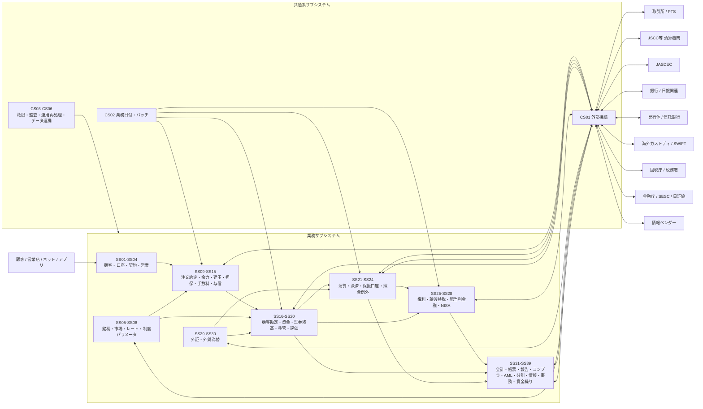
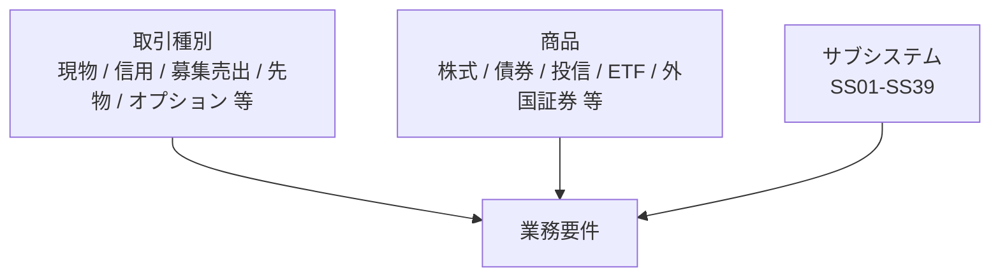

# 日本証券基幹システム 全体ランドスケープ v0.2

## 1. 分類

本図はサブシステムのみを描く。現物/信用等の取引種別、株式/債券/投信等の商品は別軸とする。

## 2. 全体像

## 3. 取引種別・商品との交差

例: `信用取引 × 国内株式`は、SS09注文約定、SS10余力、SS12建玉、SS13担保保証金、SS16顧客勘定、SS18証券残高、SS21清算、SS22決済、SS25権利、SS26譲渡益税、SS31会計、SS32帳票等を横断する。

## 4. 主な対外関係

| 外部主体 | 主に関係するサブシステム |
|---|---|
| 取引所/PTS | SS09, SS34, CS01 |
| JSCC等清算機関 | SS21, SS22, SS24, SS39, CS01 |
| JASDEC | SS18, SS19, SS22, SS23, SS24, SS25, CS01 |
| 銀行 | SS17, SS22, SS30, SS39, CS01 |
| 発行体/信託銀行 | SS25, SS27, SS32, CS01 |
| 国税庁/税務署 | SS26, SS27, SS28, SS33, CS01 |
| 金融庁/SESC/日証協 | SS33, SS34, SS35, SS36, CS01 |
| 海外カストディ/SWIFT | SS29, SS30, SS22, SS24, CS01 |
| 情報ベンダー | SS05, SS06, SS07, SS25, CS01 |

## 5. 公開根拠

- NRI THE STAR: https://www.nri.com/jp/service/solution/the_star.html
- NRI I-STAR/CORE: https://www.nri.com/jp/service/solution/i_star_core.html
- NRI I-STAR/GV: https://www.nri.com/jp/service/solution/i_star_gv.html
- JASDEC: https://www.jasdec.com/rule/
