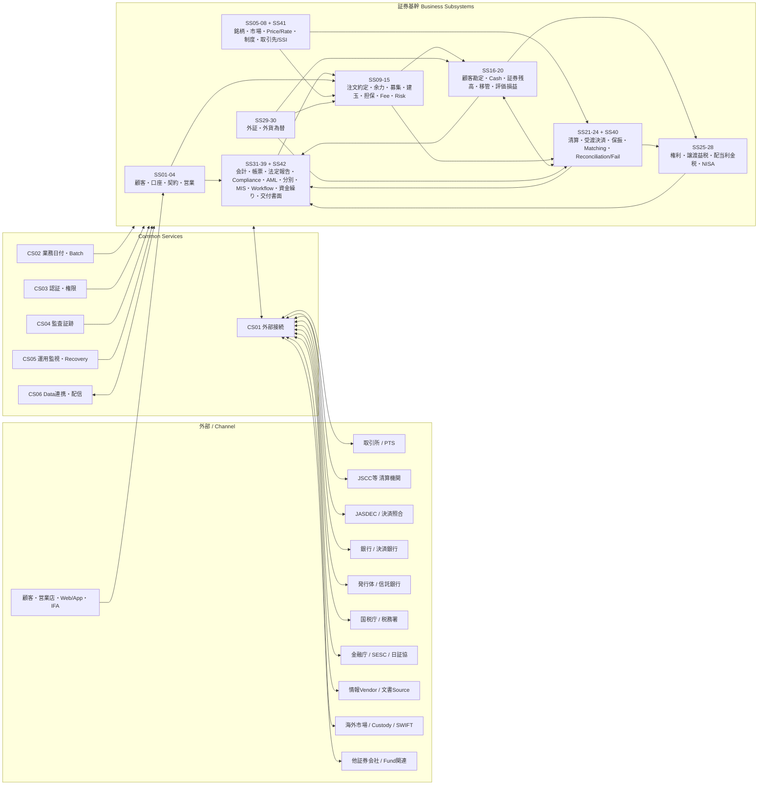
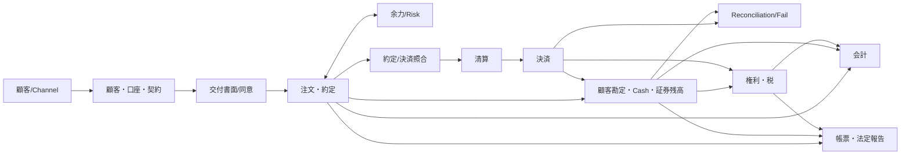
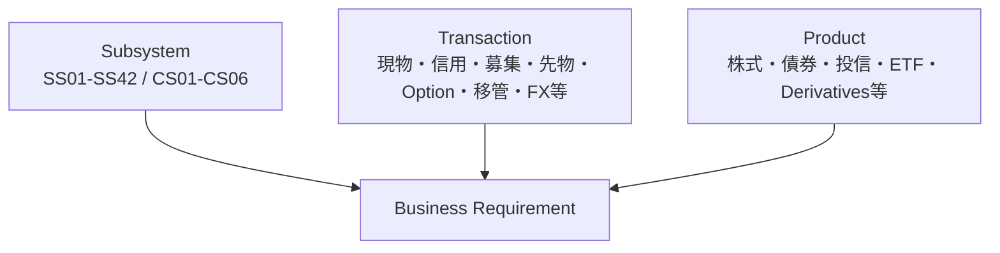

# 日本証券基幹システム 全体ランドスケープ v0.4

**Status:** Draft for Architecture Freeze  
**as-of:** 2026-09-08

> 本図は論理サブシステムのみを描く。現物/信用等の取引種別、株式/債券/投信等の商品は別軸とする。

## 1. One-page System Landscape

---

## 2. Main Business Backbone

約定/決済照合を利用しない取引では `O -> CL` の直接経路も成立する。

---

## 3. 3-axis Requirement Model

例: `SS09 注文・約定 × TR02 信用取引 × PR01 国内株式`

---

## 4. Architecture Gap Reviewで追加した3責務

| ID | 追加理由 |
|---|---|
| SS40 約定照合・決済照合 | JASDEC決済照合等のMatching lifecycleを、残高Reconciliation/Failから分離 |
| SS41 取引先・決済条件(SSI) | Counterparty、決済口座、Custodian、Settlement Bank、SSIのAuthority不足を補完 |
| SS42 交付書面・目論見書・同意 | 取引前文書・電子交付同意・交付証跡を、取引後帳票SS32から分離 |

詳細: `ARCHITECTURE_GAP_REVIEW_V0_3.md`

---

## 5. 総体設計Document Set

| Document | Authority |
|---|---|
| `OVERALL_DESIGN.md` | 全体システム構造/境界のAuthority |
| `CLASSIFICATION_MODEL.md` | Subsystem/Transaction/Product分類のAuthority |
| `SUBSYSTEM_CATALOG.md` | サブシステム一覧/責務のAuthority |
| `SUBSYSTEM_RELATION_MAP.md` | 内部関係のAuthority |
| `EXTERNAL_RELATION_MAP.md` | 外部主体/I/F関係のAuthority |
| `DATA_AUTHORITY_MAP.md` | Business Object正本のAuthority |
| `END_TO_END_FLOW.md` | 代表E2EフローのAuthority |
| `SCOPE_TIER_MODEL.md` | Core/Conditional/AdjacentのAuthority |
| `ARCHITECTURE_GAP_REVIEW_V0_3.md` | v0.3 Gap Review記録 |
| `TRANSACTION_CATALOG.md` | 取引種別のAuthority |
| `PRODUCT_CATALOG.md` | 商品分類のAuthority |
| `COVERAGE_MATRIX.md` | 3軸Coverage/GAP検証のAuthority |

---

## 6. Architecture Gate

個別サブシステムSkillの詳細化開始条件:

1. 42業務SS + 6共通SSの過不足Review完了
2. 内部関係Review完了
3. 外部関係Review完了
4. Data Authority Review完了
5. E2E Flow Review完了
6. Scope Tier確定
7. Coverage Matrixで重大GAPなし
8. ID/名称をv1.0でFreeze

Architecture Gate通過前は、新規の詳細Skill作成を進めない。
