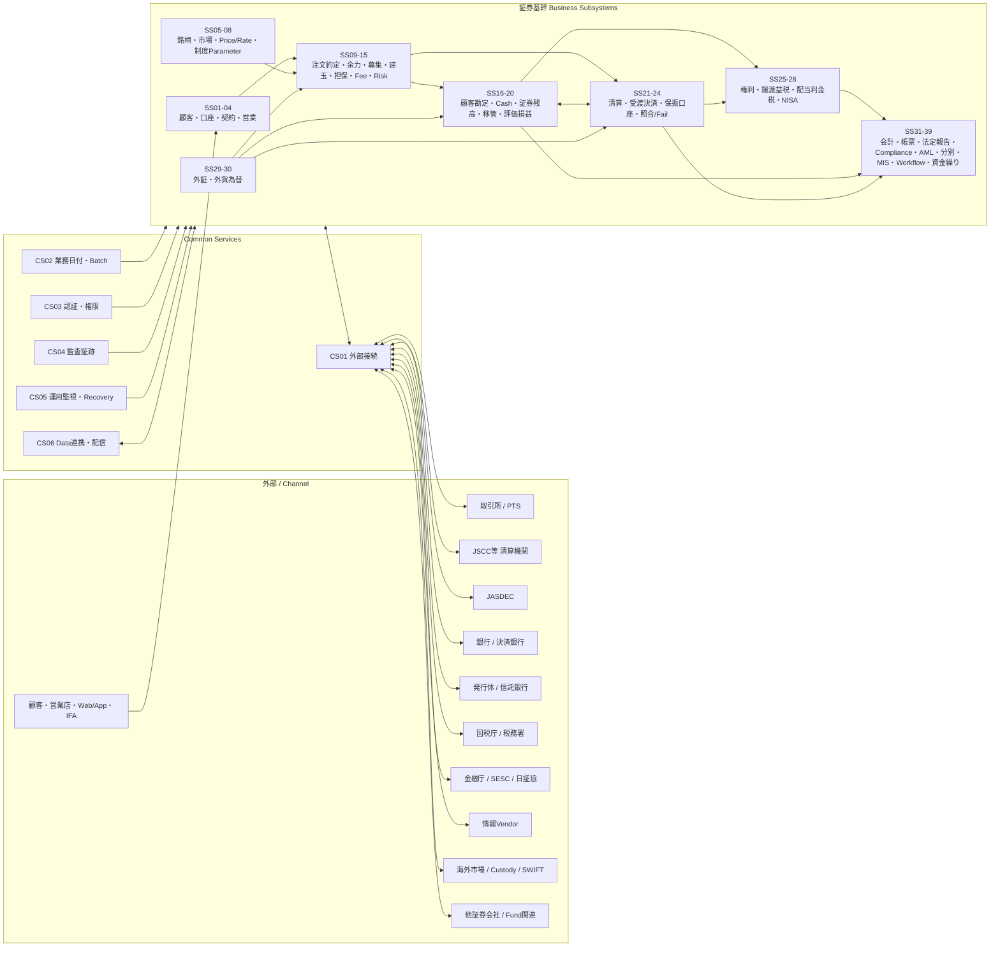
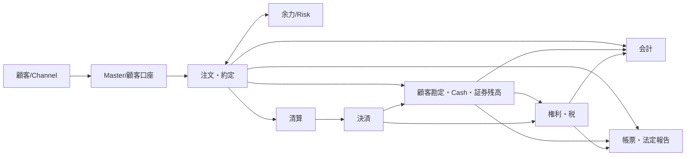

# 日本証券基幹システム 全体ランドスケープ v0.3

**Status:** Draft for Architecture Review  
**as-of:** 2026-09-08

> 本図はサブシステムのみを描く。現物/信用等の取引種別、株式/債券/投信等の商品は別軸とする。

## 1. One-page System Landscape

---

## 2. Main Business Backbone

---

## 3. 3-axis Requirement Model

例:

`SS09 注文・約定 × TR02 信用取引 × PR01 国内株式`

---

## 4. 総体設計Document Set

| Document | Authority |
|---|---|
| `OVERALL_DESIGN.md` | 全体システム構造/境界のAuthority |
| `CLASSIFICATION_MODEL.md` | Subsystem/Transaction/Product分類のAuthority |
| `SUBSYSTEM_CATALOG.md` | サブシステム一覧/責務のAuthority |
| `SUBSYSTEM_RELATION_MAP.md` | 内部関係のAuthority |
| `EXTERNAL_RELATION_MAP.md` | 外部主体/I/F関係のAuthority |
| `DATA_AUTHORITY_MAP.md` | Business Object正本のAuthority |
| `END_TO_END_FLOW.md` | 代表E2EフローのAuthority |
| `TRANSACTION_CATALOG.md` | 取引種別のAuthority |
| `PRODUCT_CATALOG.md` | 商品分類のAuthority |
| `COVERAGE_MATRIX.md` | 3軸Coverage/GAP検証のAuthority |

---

## 5. Architecture Gate

個別サブシステムSkillの詳細化開始条件:

1. 39業務SS + 6共通SSの過不足Review完了
2. 内部関係Review完了
3. 外部関係Review完了
4. Data Authority Review完了
5. E2E Flow Review完了
6. Coverage Matrixで重大GAPなし

Architecture Gate通過前は、既存の詳細SkillはReference Sampleとして保持するが、新規の詳細化を進めない。
