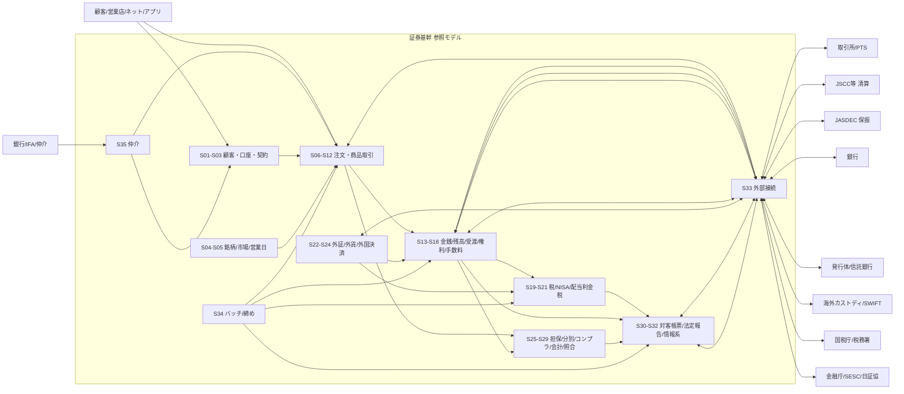
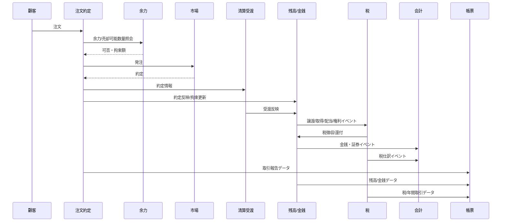

# 日本証券基幹システム 全体ランドスケープ

## 1. 全体像

## 2. 中核Business Flow

## 3. 設計原則

- 業務イベントをサブシステム間の契約とする。
- 税、会計、帳票は注文画面の派生機能ではなく、独立した業務責務として扱う。
- 権利処理は残高・税・会計・帳票へ横断影響する。
- 外部接続は通信だけでなく、業務ACK/NACK、再送、重複、締切を持つ。
- 年次帳票は日次取引の単純合計ではなく、年度中の訂正/取消/移管/損益通算/税還付を反映する。
