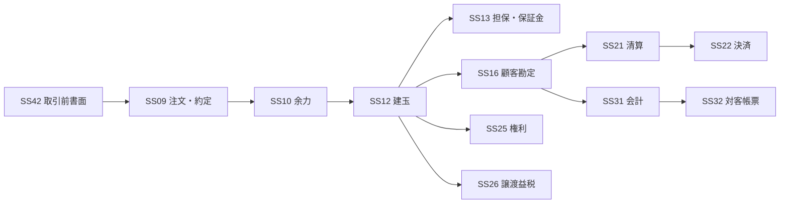

# 取引種別カタログ v1.0

**Status:** Frozen  
**as-of:** 2026-09-08

> 取引種別は「何をするか」の軸。サブシステムではない。

| ID | 取引種別 | 説明 |
|---|---|---|
| TR01 | 現物取引 | 現物の買付・売却。国内/外国、株式/債券等の商品軸と組み合わせる。 |
| TR02 | 信用取引 | 信用新規、返済、現引、現渡等。注文約定、余力、建玉、担保、決済等を横断する。 |
| TR03 | 募集・売出取引 | IPO/PO、募集、売出、申込、抽選、配分、払込。 |
| TR04 | 投資信託取引 | 購入、積立、解約、買取等。 |
| TR05 | 債券取引 | 買付、売却等。利金/償還は関連Eventとして権利SSへ連携する。 |
| TR06 | 先物取引 | 新規建、反対売買、最終決済等。 |
| TR07 | オプション取引 | 新規建、反対売買、権利行使、割当等。 |
| TR08 | 貸借取引 | 貸株、借株、債券貸借、Repo等。 |
| TR09 | 移管・振替 | 入庫、出庫、他社移管、口座振替等。 |
| TR10 | 外国為替取引 | 円貨/外貨転換、外貨決済に伴う為替取引。 |
| TR11 | 権利行使・Corporate Action取引 | 新株予約権行使、TOB応募等、顧客意思を伴う権利関連取引。 |

## 設計原則

1. TRは独立したApplication境界を意味しない。
2. 1つのTRは複数SSを横断する。
3. 同じTRでもProductによってRule、Settlement、Tax、Documentが変わる。
4. TR固有Ruleは `SS × TR × PR` の交点に記述する。

## 例: 信用取引

このため`信用取引`を1個のサブシステムとして扱わない。

## v1.0 Freeze

TR01-TR11をArchitecture v1.0の取引種別Baselineとする。追加/削除/意味変更はChange Request対象とする。
