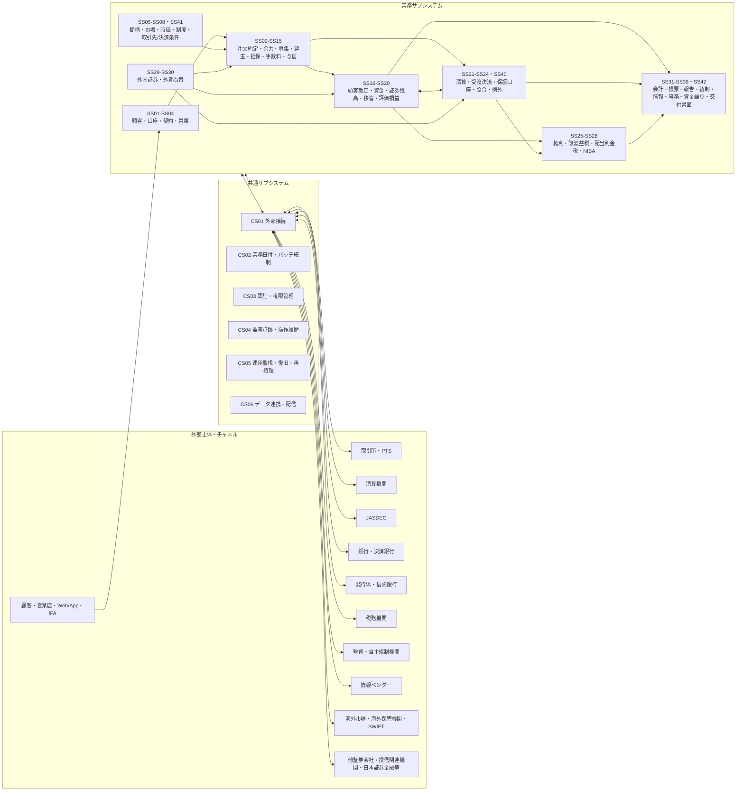
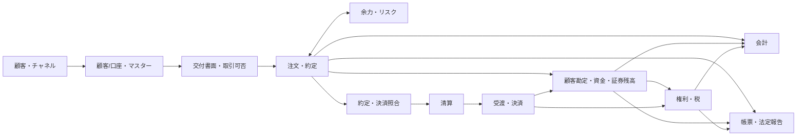
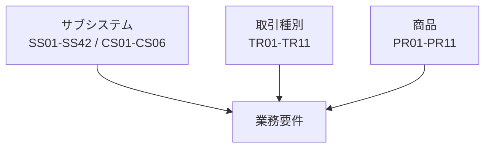

# システム全体構成図

## 1. 全体構成

## 2. 主処理経路

約定・決済照合を利用しない取引では、注文・約定から清算へ直接連携する。

## 3. 要件の3軸

## 4. 設計上の関係

- `業務機能一覧.md`: 各サブシステムの名称と主責務
- `業務機能関係図.md`: サブシステム間の主要入出力関係
- `外部関係図.md`: 外部主体との接続関係
- `データ正本管理表.md`: 主要業務データの正本
- `業務一貫処理図.md`: 代表的な業務の端から端までの流れ
