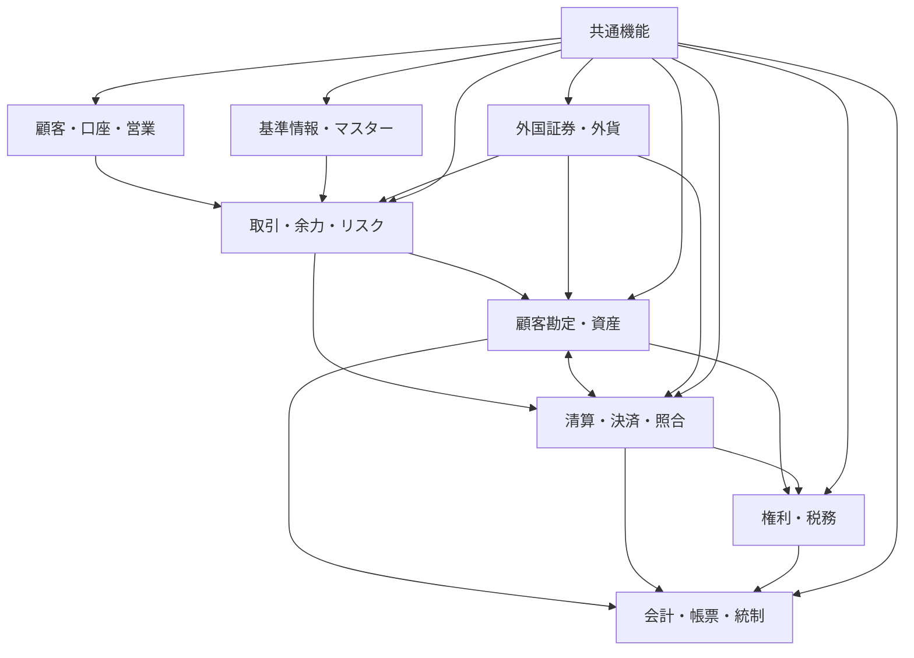
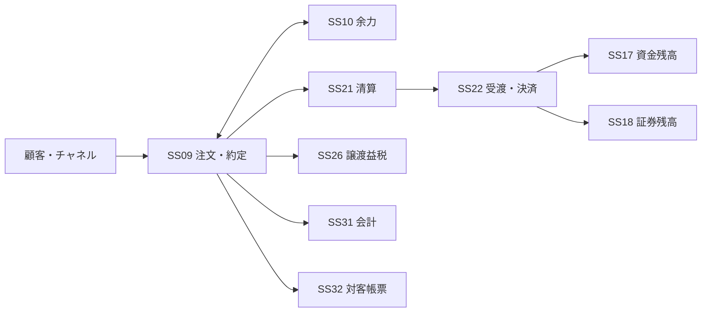

# 日本証券基幹システム 全体設計書

## 1. 目的

本書は、日本の総合証券会社における基幹・バックオフィス業務を対象として、システム全体の業務機能分割、責務境界、主要データ、内部関係、外部関係および代表的な業務処理の基本構造を定義する。

本書には作業経緯、レビュー履歴、特定企業・特定製品との比較、検討過程は記載しない。

## 2. 設計対象

設計対象は次のとおりとする。

- 顧客・口座・契約
- 基準情報・マスター
- 注文・約定
- 余力・建玉・担保・与信
- 顧客勘定・資金・証券残高
- 清算・受渡・決済・照合
- 権利・税務・NISA
- 外国証券・外貨
- 会計・帳票・法定報告
- コンプライアンス・AML・分別管理
- 情報系・事務ワークフロー・資金繰り
- 外部接続、業務日付・バッチ、認証・権限、監査、運用、データ連携

顧客向けWeb/スマートフォン画面、全社人事給与等の証券基幹外システムは設計対象外とし、必要な接続関係のみ定義する。

## 3. 論理構成

論理サブシステムは以下の48単位とする。

- 業務サブシステム: SS01～SS42
- 共通サブシステム: CS01～CS06

詳細な名称・責務は `業務機能一覧.md` を正本とする。

## 4. 要件分類

業務要件は、次の3軸で管理する。

`サブシステム × 取引種別 × 商品`

- サブシステム: 業務機能・責務
- 取引種別: 現物、信用、募集、先物等の取引行為
- 商品: 株式、債券、投資信託等の取引対象

取引種別と商品をサブシステム階層へ混在させない。

詳細は `分類モデル.md`、`取引種別一覧.md`、`商品一覧.md` を参照する。

## 5. 主要業務処理チェーン

### 5.1 国内株式 現物買付

### 5.2 国内株式 現物売却

売却時は、証券残高・売却可能数量の確認、余力拘束、取得価額の割当、譲渡損益・税額算定、清算・決済、資金受入、会計、帳票を連携して処理する。

### 5.3 信用取引

信用取引は独立サブシステムではなく、注文・約定、余力、建玉、担保・保証金、与信、顧客勘定、残高、清算・決済、権利、税、会計、帳票を横断する取引種別として扱う。

## 6. データ正本

同一の業務情報を複数サブシステムで正本化しない。

主要な正本は次のとおりとする。

| 業務データ | 正本サブシステム |
|---|---|
| 顧客属性 | SS01 |
| 口座 | SS02 |
| 契約・サービス | SS03 |
| 銘柄 | SS05 |
| 注文・約定 | SS09 |
| 余力 | SS10 |
| 建玉 | SS12 |
| 顧客債権債務 | SS16 |
| 資金残高 | SS17 |
| 証券残高 | SS18 |
| 清算債権債務 | SS21 |
| 決済指図・決済状態 | SS22 |
| 権利イベント | SS25 |
| 税務取得価額・譲渡損益 | SS26 |
| 会計仕訳 | SS31 |
| 約定・決済照合状態 | SS40 |
| 取引先・決済条件 | SS41 |
| 交付書面・同意・交付証跡 | SS42 |

詳細は `データ正本管理表.md` を参照する。

## 7. 内部インターフェース

内部連携は、原則として業務オブジェクトまたは業務イベント単位で定義する。

代表例:
- 顧客属性変更
- 口座開設・口座状態変更
- 銘柄変更
- 注文受付・注文拒否
- 約定成立・約定訂正
- 余力拘束・解放
- 建玉生成・返済
- 顧客債権債務生成
- 清算債権債務生成
- 決済指図生成・決済完了・決済失敗
- 権利イベント登録・権利確定・支払
- 税取得・譲渡・徴収・還付
- 会計仕訳生成
- 帳票発行

各連携データは、業務日付、発生元、元データ識別子、版、訂正元を追跡可能とする。

## 8. 外部関係

主な外部主体は次のとおりとする。

- 取引所・PTS
- 清算機関
- JASDEC
- 銀行・決済銀行
- 発行体・株主名簿管理人・信託銀行
- 税務機関
- 金融監督・自主規制機関
- 情報ベンダー
- 他証券会社・取引相手
- 投資信託関連機関
- 日本証券金融等
- 海外市場・海外保管機関・SWIFT

外部通信の共通制御はCS01が担当し、受信した業務内容の正本は各業務サブシステムが保持する。

詳細は `外部関係図.md` を参照する。

## 9. 業務日付・オンライン・バッチ

オンライン処理を中心とする業務:
- 顧客・口座照会
- 注文受付・注文可否判定
- 余力計算
- 市場発注・約定受信
- 入出金受付

バッチ・締め処理を中心とする業務:
- 日次残高確定
- 清算・決済予定作成
- 日次照合
- 権利基準日処理
- 税日次・年次処理
- 会計締め
- 法定帳簿・報告
- 年間取引報告
- NISA年次処理

CS02は処理順序、業務日付、締切、再開点を統制し、各業務計算そのものは各業務サブシステムが行う。

## 10. 共通設計原則

全サブシステムで次を共通要件とする。

- 重複処理防止
- 訂正・取消履歴の保持
- 業務日付とシステム時刻の分離
- 再実行・再送・再処理
- 監査証跡
- 職務分掌・承認
- 個人情報・機微情報のアクセス制御
- 外部インターフェースの応答・再送・順序管理
- 締め後訂正
- 障害復旧・事業継続

## 11. 関連設計書

- `システム全体構成図.md`
- `業務機能一覧.md`
- `業務機能関係図.md`
- `外部関係図.md`
- `データ正本管理表.md`
- `接続関係図.md`
- `業務一貫処理図.md`
- `分類モデル.md`
- `取引種別一覧.md`
- `商品一覧.md`
- `適用範囲区分.md`
- `対応範囲マトリクス.md`
