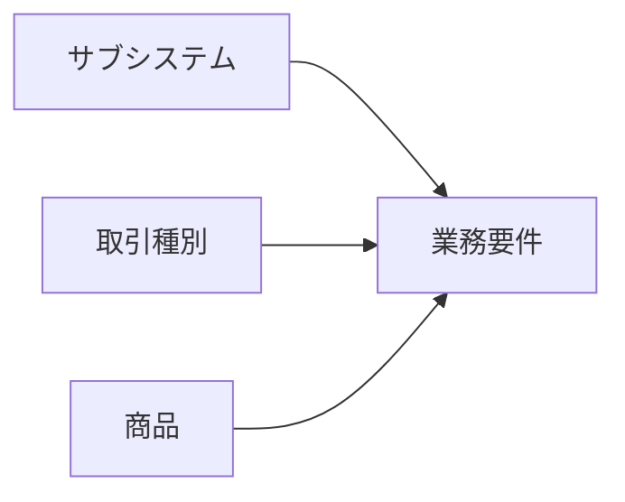

# 分類体系

## 1. 基本方針

日本証券基幹システムの業務要件は、次の3軸を分離して整理する。

1. **サブシステム**: どの業務機能・責務が処理するか
2. **取引種別**: 何をする取引か
3. **商品**: 何を取引するか

基本座標は次のとおりとする。

`サブシステム × 取引種別 × 商品`

例:

`SS09 注文・約定管理 × TR02 信用取引 × PR01 国内株式`

## 2. サブシステム

サブシステムは独立した業務責務、状態、残高、正本データ、または法定責任を持つ論理単位とする。

例:
- 顧客属性管理
- 口座管理
- 銘柄管理
- 注文・約定管理
- 余力管理
- 顧客勘定管理
- 証券預り・残高管理
- 清算管理
- 受渡・決済管理
- 権利管理
- 譲渡益税・特定口座
- 会計
- 対客帳票・電子交付

商品名や取引名だけを理由にサブシステムを追加しない。

## 3. 取引種別

取引種別は顧客または証券会社が行う業務行為を示す。

例:
- 現物取引
- 信用取引
- 募集・売出取引
- 投資信託取引
- 債券取引
- 先物取引
- オプション取引
- 貸借取引
- 移管・振替
- 外国為替取引
- 権利行使

1つの取引種別は複数のサブシステムを横断する。

## 4. 商品

商品は取引対象となる金融商品を示す。

例:
- 国内株式
- 外国株式
- ETF・ETN
- REIT等
- 国内債券
- 外国債券
- 投資信託
- 先物
- オプション
- CB・新株予約権等

同一商品でも取引種別や口座区分によって関与するサブシステムと業務規則が変わる。

## 5. 外国証券業務の扱い

外国株式・外国債券は商品軸に属する。一方、海外市場、海外保管機関、多通貨、外国税、海外決済等の固有業務は複数の商品・取引に共通するため、`SS29 外国証券業務管理`を横断的な業務サブシステムとして配置する。

## 6. 共通サブシステム

次の機能は商品・取引種別を横断する共通サブシステムとする。

- CS01 外部接続
- CS02 業務日付・バッチ統制
- CS03 認証・権限管理
- CS04 監査証跡・操作履歴
- CS05 運用監視・復旧・再処理
- CS06 データ連携・配信

## 7. 判定基準

新しい業務機能を追加する場合は次の順序で判定する。

1. 既存サブシステムの責務として処理できるか
2. 単なる取引種別の差か
3. 単なる商品の差か
4. 独立した状態・残高・正本・法定責任を持つか

4に該当し、既存責務へ自然に配置できない場合のみ、新規サブシステム追加を検討する。
