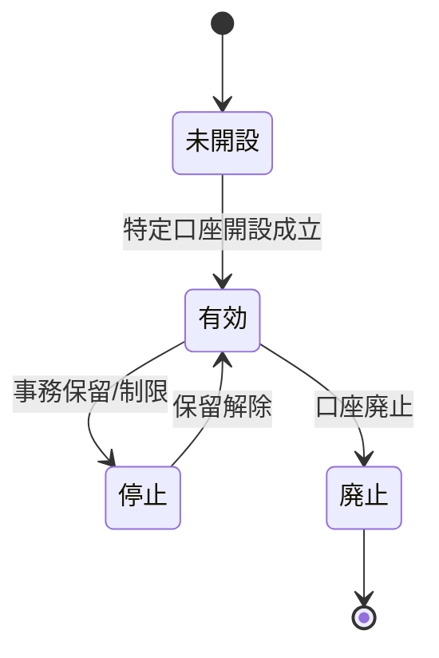
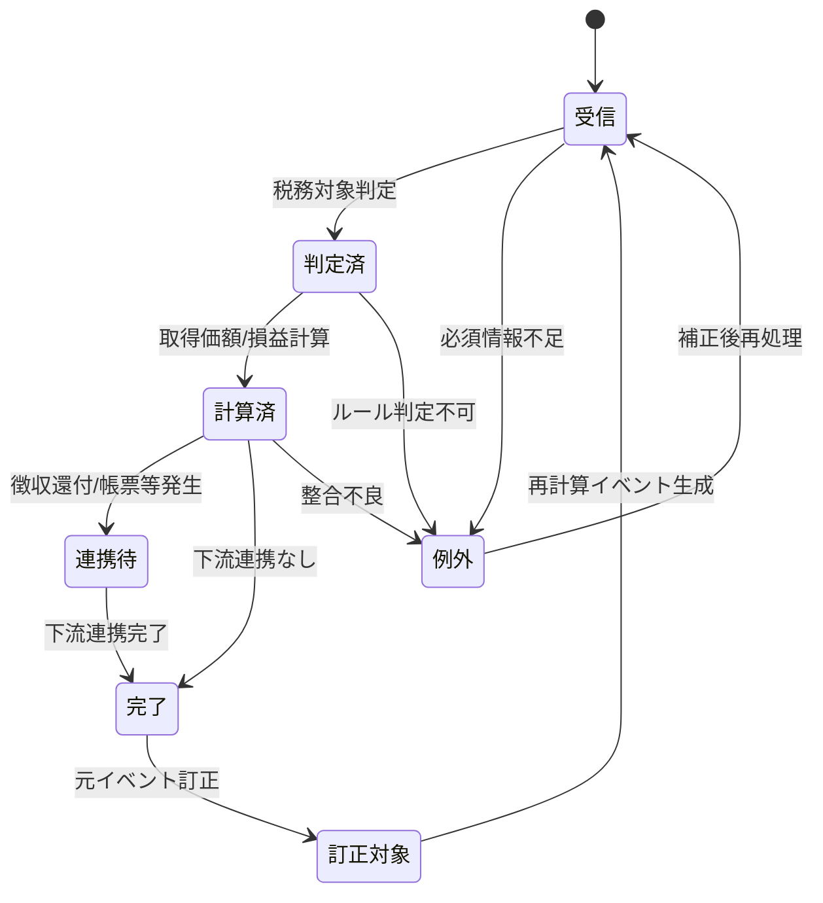
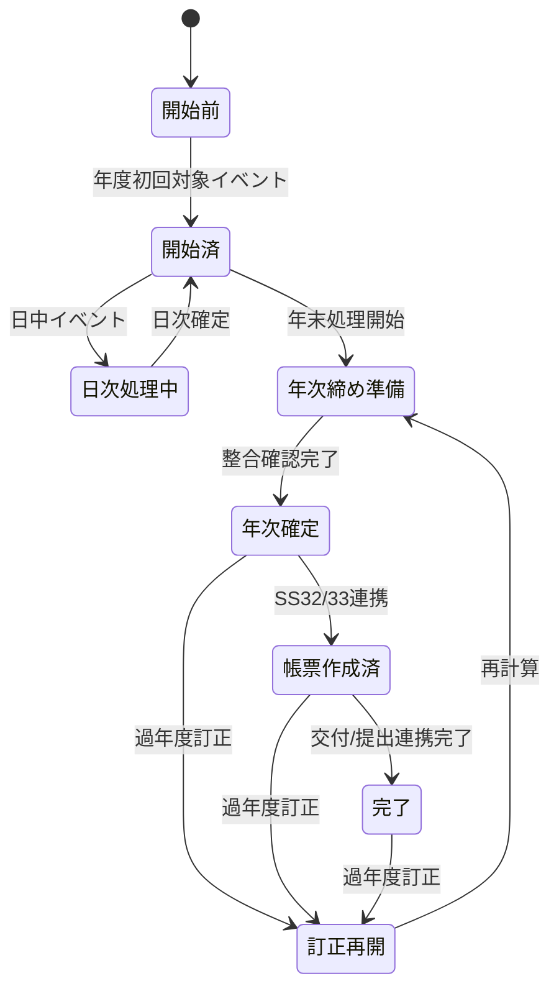

# SS26 譲渡益税・特定口座 データ・状態設計

**版:** 1.0  
**基準日:** 2026-09-08

---

## 1. データ設計方針

SS26は税額計算結果だけを保持するのではなく、**再計算可能な税務元帳**を保持する。

基本原則:

1. 約定・移管・権利等の元イベントを税務イベントへ正規化する。
2. 税務取得価額、年初来損益、徴収税額、還付税額を別オブジェクトとして管理する。
3. 訂正時に過去を物理上書きしない。
4. すべての派生値を元イベント・ルール版・税率版へ追跡可能にする。
5. 特定口座内と口座外、NISAと課税口座を同一残高に混在させない。

---

## 2. 主要データオブジェクト

| オブジェクトID | 名称 | 主キー例 | 主な内容 |
|---|---|---|---|
| 税26-D01 | 税務口座 | 顧客ID+税務口座ID | 一般/特定/NISA連携、源泉徴収選択、配当受入選択、適用期間 |
| 税26-D02 | 税務イベント | 税務イベントID | 取得、譲渡、移管、権利、差金決済、訂正、取消等 |
| 税26-D03 | 税務取得価額残 | 税務口座ID+銘柄ID+区分 | 数量、取得価額総額、1単位取得価額 |
| 税26-D04 | 取得価額履歴 | 履歴ID | イベント前後数量/金額、平均計算、丸め結果 |
| 税26-D05 | 譲渡損益明細 | 損益ID | 譲渡収入、取得費、譲渡費用、損益、税務区分 |
| 税26-D06 | 年初来税務元帳 | 税務年度+税務口座ID | 年初来収入、取得費等、損益、通算所得、徴収/還付累計 |
| 税26-D07 | 税徴収還付明細 | 税イベントID | 所得税系、住民税、徴収/還付、差額、資金連携状態 |
| 税26-D08 | 配当損益通算元帳 | 年度+税務口座ID | 配当等総額、譲渡損失、通算後金額、還付額 |
| 税26-D09 | 年間取引報告元帳 | 年度+税務口座ID+版 | 年間取引報告書の全論理項目 |
| 税26-D10 | 税務ルール版 | ルールID+版 | 適用期間、税率、丸め、商品/取引適用条件 |
| 税26-D11 | 訂正連鎖 | 訂正ID | 訂正元、影響対象、再計算範囲、再発行/再提出状態 |

---

## 3. 税務口座

### 3.1 主な項目

| 項目 | 必須 | 内容 |
|---|:---:|---|
| 顧客ID | ○ | SS01の顧客識別子 |
| 税務口座ID | ○ | SS26内の税務口座識別子 |
| 証券口座ID | ○ | SS02口座識別子 |
| 口座区分 | ○ | 一般/特定/NISA連携区分 |
| 特定口座区分 | 条件 | 源泉徴収あり/なし |
| 配当等受入区分 | 条件 | 対象配当等を源泉徴収口座へ受け入れるか |
| 適用開始日 | ○ | 当該契約状態の開始日 |
| 適用終了日 | - | 終了日 |
| 状態 | ○ | 有効/停止/廃止/訂正中等 |
| 元契約版 | ○ | SS03契約版への参照 |

### 3.2 状態



税務口座状態はSS03契約状態を参照して派生管理し、SS26が契約そのものの正本にはならない。

---

## 4. 税務イベント

### 4.1 イベント種別

| 種別 | 代表的な発生源 |
|---|---|
| 取得 | SS09買付、SS19入庫、SS25権利 |
| 譲渡 | SS09売却、償還・解約等 |
| 信用差益 | SS09/SS12信用決済 |
| 信用差損 | SS09/SS12信用決済 |
| 入庫 | SS19 |
| 出庫 | SS19 |
| 権利調整 | SS25 |
| 資本払戻 | SS25 |
| NISA移管 | SS28/SS19 |
| 配当通算 | SS27 |
| 訂正 | 元イベントAuthority |
| 取消 | 元イベントAuthority |

### 4.2 必須項目

```text
税務イベントID
元サブシステムID
元オブジェクトID
元イベントID
元イベント版
イベント種別
税務イベント日
業務日
税務年度
顧客ID
税務口座ID
銘柄ID
数量
金額
通貨
税務商品区分
口座区分
訂正元税務イベントID
受信日時
処理状態
```

### 4.3 処理状態



---

## 5. 税務取得価額残

### 5.1 主な項目

| 項目 | 内容 |
|---|---|
| 税務口座ID | 口座単位 |
| 銘柄ID | 税務上の同一銘柄単位 |
| 税務商品区分 | 上場株式等/一般株式等等 |
| 保有数量 | 取得価額計算対象数量 |
| 取得価額総額 | 現在残に対応する総額 |
| 1単位取得価額 | 総平均法に準ずる方法の結果 |
| 最終計算イベントID | 最新更新イベント |
| ルール版 | 計算ルール版 |
| 更新業務日 | 最終更新日 |

### 5.2 不変条件

- `保有数量 < 0` を許容しない。
- SS18の証券残高と常に同一とは限らないが、差異理由を説明可能であること。
- 貸株、受渡待、移管中等は数量区分を明示する。
- 取得価額総額と1単位取得価額の関係は丸め差を含め追跡できること。

---

## 6. 年初来税務元帳

### 6.1 主な残高

```text
税務年度
税務口座ID
上場分譲渡収入累計
上場分取得費・譲渡費用累計
特定信用等差益累計
特定信用等差損累計
年初来譲渡損益
源泉徴収口座内通算所得金額
所得税系必要税額累計
住民税必要税額累計
所得税系徴収累計
住民税徴収累計
所得税系還付累計
住民税還付累計
対象配当等総額
配当等既徴収税額
配当損益通算後課税額
年間元帳状態
```

### 6.2 状態



---

## 7. 税徴収還付明細

税徴収と還付を同一符号だけで表現せず、業務種別を明示する。

| 項目 | 内容 |
|---|---|
| 税イベントID | 一意ID |
| 税務口座ID | 対象口座 |
| 税務年度 | 年 |
| 起因税務イベントID | 売却/配当通算等 |
| 種別 | 徴収/還付/訂正徴収/訂正還付 |
| 所得税額 | 基礎所得税 |
| 復興特別所得税額 | 内訳管理可能 |
| 防衛特別所得税額 | 2027年以後の内訳管理可能 |
| 所得税系合計 | 実際の所得税系徴収額 |
| 住民税額 | 株式等譲渡所得割等 |
| 外国所得税額 | 対象時 |
| 資金連携状態 | 未連携/依頼済/反映済/失敗 |
| 会計連携状態 | 未連携/連携済 |

---

## 8. 年間取引報告元帳

帳票レイアウトそのものをSS26データモデルに固定せず、法定様式の論理項目を保持する。

主なグループ:

1. 年分・提出区分
2. 特定口座開設者
3. 譲渡明細
4. 年間譲渡損益集計
5. 配当等明細
6. 配当等年次集計
7. 譲渡損失・差引・納付/還付
8. 金融商品取引業者情報
9. 訂正・無効・摘要

物理PDF座標はSS32/SS33側で最新様式版を用いて生成する。

---

## 9. 訂正連鎖

過去イベント訂正時は影響対象を明示的に保持する。

```text
訂正イベント
  ├─ 元税務イベント
  ├─ 取得価額履歴
  ├─ 後続譲渡損益
  ├─ 年初来税務元帳
  ├─ 徴収/還付
  ├─ 配当損益通算
  ├─ 年間取引報告元帳
  └─ 帳票版/提出版
```

訂正起点以後に同銘柄の取得・譲渡がある場合、後続取得価額まで再計算対象となる。

---

## 10. データ保全・監査

最低限次を満たす。

- 元イベントIDを削除しない。
- ルール版・税率版を保存する。
- 計算前/後値を保存する。
- 手動補正は補正理由、申請者、承認者を保持する。
- 個人番号等の機微情報を税務計算データへ不要に複製しない。
- 年次帳票データは作成版ごとに固定保存する。
- 再処理しても同一イベントを二重計上しない。
