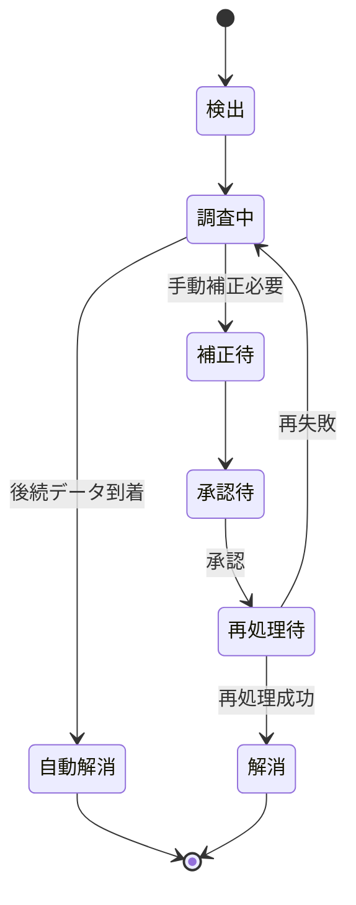
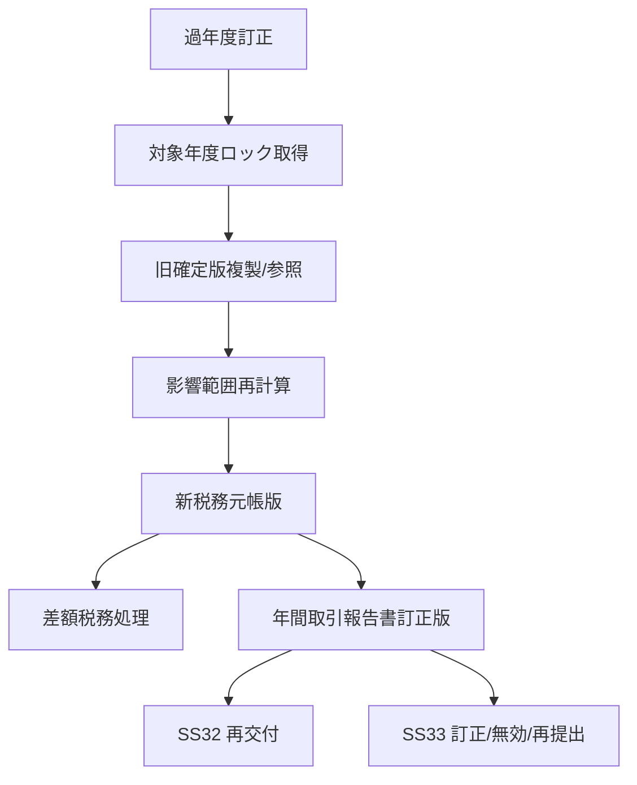

# SS26 譲渡益税・特定口座 例外・訂正・再処理設計

**版:** 1.0  
**基準日:** 2026-09-08

---

## 1. 基本方針

税務処理は過去イベントの訂正が後続の取得価額・譲渡損益・源泉徴収・帳票へ連鎖するため、単純な上書き修正を禁止する。

原則:

1. 元イベントを削除しない。
2. 訂正・取消を別イベントとして保持する。
3. 影響範囲を機械的に特定する。
4. 差額徴収/還付で補正する。
5. 年次帳票・提出物まで追跡する。
6. 手動補正は承認・理由・証跡を必須とする。

---

## 2. 例外分類

| 例外ID | 分類 | 例 |
|---|---|---|
| 税26-E001 | 入力欠落 | 口座区分不明、銘柄税区分不明 |
| 税26-E002 | 取得価額不明 | 他社入庫で取得価額不足 |
| 税26-E003 | 数量不整合 | 税務残とSS18残の説明不能差異 |
| 税26-E004 | 契約不整合 | 特定口座契約開始前の対象取引 |
| 税26-E005 | 税率不明 | 対象日に有効な税率版なし |
| 税26-E006 | 権利条件不備 | 払戻等割合・税務区分未確定 |
| 税26-E007 | 徴収還付不整合 | SS17反映額とSS26税額差異 |
| 税26-E008 | 年次帳票不整合 | 明細合計と年次集計不一致 |
| 税26-E009 | 訂正連鎖失敗 | 後続イベント再計算不能 |
| 税26-E010 | 重複/順序異常 | 同版二重受信、訂正版先着 |

---

## 3. 例外状態



重大税務例外は日次/年次締め阻害フラグを持つ。

---

## 4. 約定取消

### 4.1 処理

```text
約定取消受信
 ↓
元税務イベント特定
 ↓
元取得/譲渡影響を反転
 ↓
後続取得価額を再計算
 ↓
後続譲渡損益を再計算
 ↓
年初来税額再計算
 ↓
差額徴収/還付
 ↓
帳票/会計再連携
```

買付取消の場合、その買付後に同一銘柄の売却があると平均取得価額が変化するため、後続売却まで再計算する。

---

## 5. 約定訂正

価格、数量、約定日、取引区分、費用等の訂正を受けた場合、次の2段階で扱う。

1. 旧版影響を取消
2. 新版を再適用

差分だけを直接税額へ足し引きせず、税務元帳を正規ルールで再計算する。

---

## 6. 取得価額不明入庫

他社移管等で取得価額が必要だが不足している場合:

- 数量だけを確定税務取得価額残へ登録しない。
- `取得価額確定待` の仮状態で隔離する。
- SS19から追加情報/証憑を待つ。
- 確定前に売却が発生した場合は、税務処理保留または制度・会社手続に基づく例外処理へ送る。
- オペレータが任意金額を直接入力して完了させない。

---

## 7. 権利イベント訂正

権利訂正は影響が大きいため、銘柄単位の再計算範囲を抽出する。

例:

```text
分割比率 1:2 → 1:3 訂正
 ↓
効力日前取得価額残へ戻す
 ↓
正しい比率を再適用
 ↓
効力日以後の全取得/譲渡を順次再計算
 ↓
税額差額処理
```

---

## 8. 税率・制度パラメータ訂正

誤った税率版が適用されたことが判明した場合:

1. 誤版を削除しない。
2. 正しいルール版を追加する。
3. 影響する税務イベントを抽出する。
4. 対象期間を再計算する。
5. 徴収/還付差額と帳票影響を生成する。

制度改定を「マスター値上書き」で処理しない。

---

## 9. 年次締め後訂正

過年度訂正では、現在年度の通常処理と分離した再計算単位を持つ。



現在年度の取得価額残にも影響する場合、年度境界を越えて後続残まで再計算する。

---

## 10. 再処理単位

| 再処理単位 | 用途 |
|---|---|
| 税務イベント単位 | 単純再送、単発訂正 |
| 口座+銘柄+期間 | 取得価額連鎖再計算 |
| 口座+税務年度 | 年初来損益/税額再計算 |
| 税務年度全体 | 制度版誤適用、大規模年次再生成 |

再処理は最小影響範囲を原則とするが、取得価額連鎖を途中で切断しない。

---

## 11. 二重計上防止

重複防止キー:

```text
元サブシステム
+ 元イベントID
+ 元イベント版
+ 税務処理種別
```

同一キーがすでに完了済みの場合は再計上せず、再送として記録する。

---

## 12. 手動補正

手動補正で変更可能なのは、制度上・運用上許可された補正項目に限定する。

必須証跡:

- 例外ID
- 補正対象
- 変更前値
- 変更後値
- 補正理由
- 根拠資料ID
- 操作者
- 承認者
- 実施日時
- 再計算結果

SS38の承認を利用し、SS26テーブルを直接SQL更新する運用を前提としない。

---

## 13. 再処理後検証

再処理完了条件:

- 税務イベント重複なし
- 取得価額数量が説明可能
- 年初来損益再集計一致
- 累計必要税額と徴収/還付累計一致
- SS17資金反映一致
- SS31会計差額連携済み
- 帳票訂正要否判定済み
- 例外証跡保存済み
