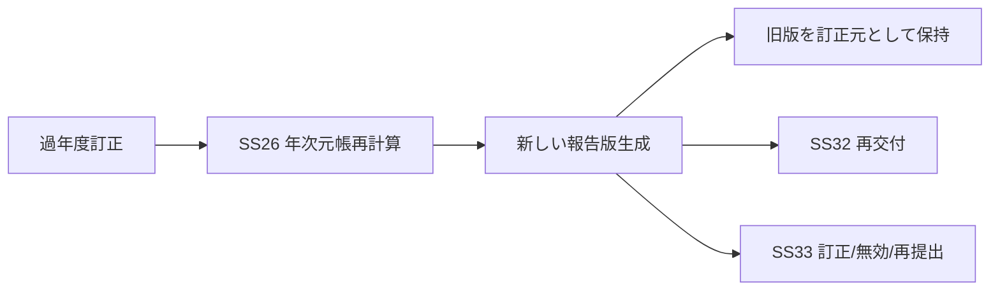

# SS26 譲渡益税・特定口座 帳票設計

**版:** 1.0  
**基準日:** 2026-09-08  
**対象様式確認:** 国税庁 令和8年8月改定様式

---

## 1. 帳票責務

SS26は帳票の税務数値・税務明細を正本として生成する。

- SS26: 税務論理データ
- SS32: 顧客向け帳票生成・電子交付・再交付
- SS33: 税務署向け法定調書生成・提出管理

物理PDF座標・電子申告ファイル仕様はSS32/SS33で管理する。

---

## 2. SS26対象帳票・出力

| 帳票/出力ID | 名称 | 出力先 | SS26責務 |
|---|---|---|---|
| 税26-P001 | 特定口座年間取引報告書 | 顧客/税務署 | 税務明細・年次集計 |
| 税26-P002 | 特定口座税務明細 | 顧客照会/内部事務 | 譲渡損益、取得価額、徴収還付履歴 |
| 税26-P003 | 取得価額払出通知データ | 顧客/移管先関連 | 払出時取得日・取得価額等 |
| 税26-P004 | 源泉徴収・還付集計 | SS33 | 納付・税務集計元データ |
| 税26-P005 | 年間取引報告訂正データ | SS32/SS33 | 訂正/無効/再発行元データ |

---

## 3. 特定口座年間取引報告書 論理レイアウト

> 下図はシステム設計用の論理レイアウトであり、国税庁公式様式そのものを複製したものではない。実際の印字位置は最新公式様式を正本とする。

```text
┌──────────────────────────────────────────────────────────────┐
│ [年分] 特定口座年間取引報告書                [提出/管理区分] │
├──────────────────────────────────────────────────────────────┤
│ A. 特定口座開設者                                             │
│ 住所                                                          │
│ 前回提出時住所                                                │
│ フリガナ / 氏名                                               │
│ 個人番号（税務署提出版のみ）                                  │
│ 生年月日                                                      │
│ 勘定の種類：保管 / 特定信用取引等 / 配当等                    │
│ 源泉徴収選択：有 / 無                                         │
│ 口座開設年月日                                                │
├──────────────────────────────────────────────────────────────┤
│ B. 譲渡の対価の支払状況                                      │
│ 種類│銘柄│株(口)数/額面│譲渡対価│譲渡年月日│譲渡区分       │
│ ...                                                           │
├──────────────────────────────────────────────────────────────┤
│ C. 譲渡に係る年間取引損益・源泉徴収税額等                     │
│ 源泉徴収税額（所得税）                                        │
│ 株式等譲渡所得割額（住民税）                                  │
│ 外国所得税額                                                  │
│        │譲渡対価│取得費・譲渡費用│差引金額                  │
│ 上場分 │        │                  │                          │
│ 特定信用分│     │                  │                          │
│ 合計   │        │                  │                          │
├──────────────────────────────────────────────────────────────┤
│ D. 配当等の交付状況                                          │
│ 種類│銘柄│数量/額面│配当等額│所得税│住民税                  │
│     │    │         │        │上場株式配当等控除額│外国所得税 │
│     │    │         │        │交付年月日                    │
│ ...                                                           │
├──────────────────────────────────────────────────────────────┤
│ E. 配当等の年次集計・損益通算                                │
│ 商品区分別 配当等額 / 所得税 / 住民税 / 特別分配金等         │
│ 譲渡損失の金額                                                │
│ 差引金額                                                      │
│ 納付税額                                                      │
│ 還付税額                                                      │
│ 摘要                                                          │
├──────────────────────────────────────────────────────────────┤
│ F. 金融商品取引業者等                                        │
│ 所在地 / 名称 / 電話番号 / 法人番号                          │
└──────────────────────────────────────────────────────────────┘
```

---

## 4. 項目マッピング

### 4.1 開設者情報

| 論理項目 | 正本 | 顧客交付版 | 税務署提出版 |
|---|---|:---:|:---:|
| 年分 | SS26 | ○ | ○ |
| 住所 | SS01/02 | ○ | ○ |
| 前回提出時住所 | SS01/02履歴 | 条件 | 条件 |
| フリガナ | SS01 | ○ | ○ |
| 氏名 | SS01 | ○ | ○ |
| 個人番号 | 専用個人番号管理領域 | × | 条件に従い○ |
| 生年月日 | SS01 | ○ | ○ |
| 保管勘定区分 | SS03/SS26 | ○ | ○ |
| 特定信用取引等勘定区分 | SS03/SS26 | ○ | ○ |
| 配当等勘定区分 | SS03/SS27 | ○ | ○ |
| 源泉徴収選択 | SS03 | ○ | ○ |
| 口座開設年月日 | SS03 | ○ | ○ |

顧客交付用では個人番号を出力しない。

### 4.2 譲渡明細

| 項目 | SS26元データ |
|---|---|
| 種類 | 税務商品区分 |
| 銘柄 | SS05参照値 |
| 株(口)数又は額面 | 譲渡数量 |
| 譲渡の対価の額 | 譲渡収入 |
| 譲渡年月日 | 確定税務イベント日 |
| 譲渡区分 | 上場分/特定信用分等の帳票区分 |

### 4.3 年間譲渡集計

| 項目 | 算出元 |
|---|---|
| 譲渡対価 | 年次譲渡収入累計 |
| 取得費及び譲渡費用 | 年次取得費等累計 |
| 差引金額 | 譲渡対価－取得費等 |
| 源泉徴収税額 | 所得税系確定徴収額 |
| 株式等譲渡所得割額 | 住民税確定徴収額 |
| 外国所得税額 | 対象取引の年次累計 |

### 4.4 配当等

配当等の個別課税正本はSS27。SS26は損益通算に必要な対象配当等を受け、年間取引報告書用に統合する。

---

## 5. 帳票生成条件

### 5.1 年次通常作成

```text
税務年度締め
+ 特定口座あり
+ 対象取引/対象配当等の年次元帳確定
→ 年間取引報告元帳生成
```

### 5.2 年中口座廃止等

年中の口座廃止等、通常年次以外の作成契機は制度要件に従いイベント化する。作成契機を単純に12月末固定にしない。

---

## 6. 帳票版管理

| 項目 | 内容 |
|---|---|
| 報告ID | 年度・口座単位の報告識別子 |
| 報告版 | 1,2,3... |
| 様式版 | 国税庁様式の版 |
| 作成区分 | 新規/追加/訂正等 |
| 無効区分 | 有効/無効 |
| 訂正元報告ID | 訂正元 |
| 税務元帳版 | 元となる年次税務元帳版 |
| 作成日時 | 生成日時 |
| 顧客交付状態 | SS32連携結果 |
| 税務署提出状態 | SS33連携結果 |

---

## 7. 訂正時の帳票処理



帳票PDFだけを手修正しない。

---

## 8. 帳票出力前検証

- 顧客・口座識別子が確定しているか
- 年分と税務年度が一致するか
- 譲渡明細合計と年間譲渡集計が一致するか
- 配当明細合計と年間配当集計が一致するか
- 納付/還付額が税徴収還付明細と一致するか
- 顧客交付版に個人番号が混入していないか
- 様式版が対象年度に有効か
- 訂正版が旧版と正しく関連しているか

---

## 9. 出典

- 税26-S017 国税庁 特定口座年間取引報告書手続
- 税26-S018 国税庁 特定口座年間取引報告書 令和8年8月様式
- 税26-S019 国税庁 記載要領 令和8年8月
