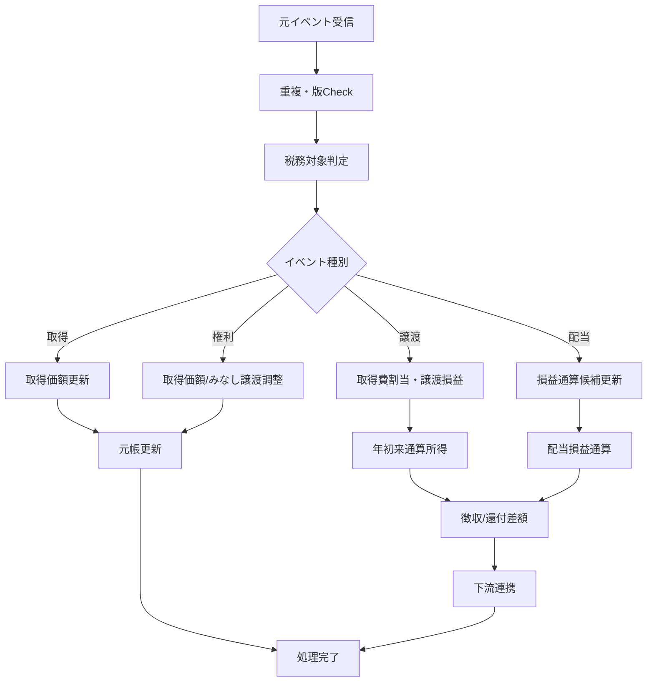
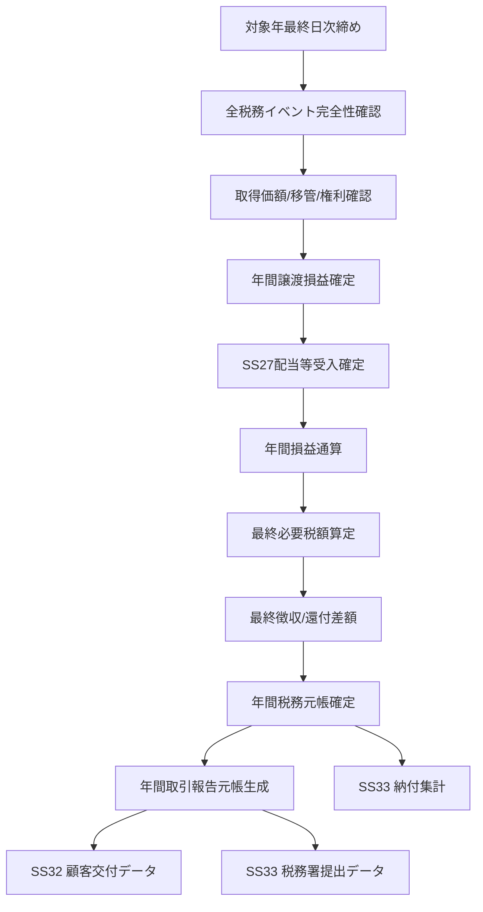

# SS26 譲渡益税・特定口座 日次・年次処理設計

**版:** 1.0  
**基準日:** 2026-09-08

---

## 1. 処理区分

SS26の処理は次の4層に分ける。

| 区分 | 主な処理 |
|---|---|
| 日中処理 | 取得、譲渡、税額、還付、訂正 |
| 日次締め | 未処理確認、残高/税額照合、日次確定 |
| 月次/随時 | 制度変更、移管・権利の集中処理、統計 |
| 年次処理 | 年間損益、配当通算、帳票、納付/提出データ |

---

## 2. 日中処理

### 2.1 基本順序



### 2.2 日中即時性が必要な処理

- 売却約定に伴う譲渡損益
- 源泉徴収/還付額
- 余力に影響する税見込/確定値
- 取得価額照会
- 訂正約定に伴う差額税額

---

## 3. 日次締め

### 3.1 日次締め開始条件

CS02から対象業務日の締め開始を受ける前に、少なくとも以下の入力締切状態を確認する。

- SS09 対象約定・訂正・取消の取込状態
- SS14 対象費用の確定状態
- SS19 当日移管の確定状態
- SS25 当日適用権利イベントの確定状態
- SS27 当日連携対象配当等の取込状態
- SS28 NISA判定の確定状態

未確定の重要入力がある場合、日次元帳を「確定」にしない。

### 3.2 日次処理一覧

| 順序 | 処理 | 内容 |
|---:|---|---|
| 1 | 未処理イベント検出 | 受信済・未計算・例外イベント抽出 |
| 2 | 訂正連鎖確認 | 当日訂正の後続影響確認 |
| 3 | 取得価額残確認 | 負数量、未計算取得、異常丸め等確認 |
| 4 | SS18数量照合 | 税務取得価額数量と証券残高の説明可能性確認 |
| 5 | 年初来元帳再集計 | 日中差分の最終反映 |
| 6 | 税徴収還付照合 | SS16/17への依頼と反映状態確認 |
| 7 | 会計連携確認 | SS31への税イベント送信状態確認 |
| 8 | 日次例外判定 | 締め阻害/翌日持越しを分類 |
| 9 | 日次確定 | 当日スナップショット固定 |

### 3.3 日次照合例

```text
照合A: SS26 税務取得価額数量
   vs SS18 税務対象保有数量

照合B: SS26 当日徴収/還付合計
   vs SS17 当日税資金Movement

照合C: SS26 税イベント件数/金額
   vs SS09/19/25/27 対象イベント件数/金額
```

差異を即エラーとはせず、受渡待、貸株中、移管中、権利処理中等の説明コードを持つ。

---

## 4. 年度切替

税務年度は原則暦年で管理する。

### 4.1 年末時点で保持するもの

- 年末税務取得価額残
- 年間譲渡収入/取得費等
- 年間譲渡損益
- 累計徴収/還付税額
- 年間対象配当等
- 配当損益通算結果
- 年間取引報告元帳
- 未解消例外

### 4.2 翌年へ引き継ぐもの

```text
引継ぐ:
  税務取得価額残
  数量
  取得日等の取得価額根拠
  未完了移管/権利処理

原則引き継がない:
  前年の源泉徴収口座内譲渡損失を
  翌年の自動源泉徴収計算へ繰越すこと
```

確定申告による3年繰越控除はSS26の翌年源泉徴収元帳とは別領域である。

---

## 5. 年次締め

### 5.1 年次締めフロー



### 5.2 年次締め前チェック

- 未処理約定 = 0
- 未処理訂正/取消 = 0 または管理承認済み持越し
- 取得価額不明残 = 0
- 移管取得価額未確定 = 0
- 重要権利イベント未確定 = 0
- 税徴収/還付未反映 = 0
- 配当通算対象のSS27連携欠落 = 0
- 帳票必須項目欠落 = 0

---

## 6. 年次納付・提出との関係

### 6.1 源泉所得税納付データ

SS26は源泉徴収額・還付額の年次集計をSS33へ渡す。提出/納付そのものはSS33/CS01の責務とする。

国税庁の現行資料に基づく原則納付期限を業務カレンダーに保持し、休日調整を含めSS33側で実際の期限を管理する。

### 6.2 特定口座年間取引報告書

税務署提出については翌年1月31日を基準期限とする。SS26ではそれより前に税務元帳・帳票論理データを確定させる。

提出期限そのものをバッチコードに埋め込まず、SS06/SS08の業務カレンダー/制度パラメータで管理する。

---

## 7. 年次訂正

年次確定後に過年度訂正が到着した場合:

```text
過年度訂正受信
 ↓
対象年度を「訂正再開」
 ↓
影響イベント以後を再計算
 ↓
年間損益・税額再確定
 ↓
差額税/還付処理判定
 ↓
年間取引報告書 訂正版生成
 ↓
SS32 再交付
SS33 訂正/無効/再提出
```

元年度の旧元帳・旧帳票版は削除しない。

---

## 8. 再実行性

すべての日次/年次処理は再実行可能にする。

- 同一入力を再処理しても二重計上しない。
- Job途中失敗時に再開点を持つ。
- 年次集計は明細正本から再生成可能にする。
- 帳票データは集計結果を手修正して成立させない。
- 手動補正が必要な場合はSS38承認を経て元税務データへ反映する。
