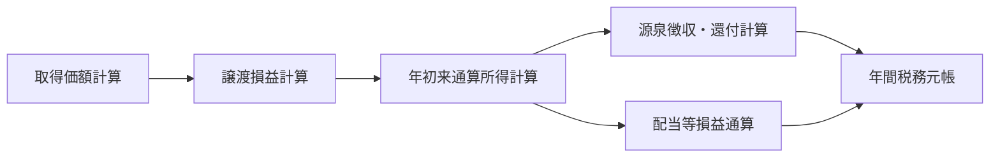

# SS26 譲渡益税・特定口座 計算設計

**版:** 1.0  
**基準日:** 2026-09-08  

---

## 1. 計算体系

SS26の計算は、次の5段階に分ける。



---

## 2. 取得価額計算

### 2.1 基本キー

取得価額は最低限、次の単位で独立して管理する。

```text
顧客ID
+ 税務口座ID
+ 税務口座区分
+ 銘柄ID
+ 税務商品区分
+ 通貨区分（必要な場合）
```

特定口座と一般口座の同一銘柄を同一平均計算に混在させない。

### 2.2 総平均法に準ずる方法

国税庁No.1466に基づき、同一銘柄を複数回取得した後に譲渡する場合、譲渡時までの取得価額・数量を用いて1単位当たり取得価額を計算する。

```text
平均取得価額 = （前回譲渡後の残存取得価額総額 + 今回譲渡までの追加取得価額総額）
                ÷
                （前回譲渡後の残存数量 + 今回譲渡までの追加取得数量）
```

1単位当たり取得価額は、現行ルールでは1円未満を切り上げる。

### 2.3 取得価額更新例

```text
1回目買付: 100株 × 1,000円 = 100,000円
2回目買付: 100株 × 1,200円 = 120,000円

平均取得価額
= 220,000 ÷ 200株
= 1,100円
```

50株を売却した場合:

```text
売却に対応する取得費 = 1,100円 × 50株 = 55,000円
残存数量 = 150株
残存取得価額 = 1,100円 × 150株 = 165,000円
```

その後100株を1,300円で追加取得した場合:

```text
新平均取得価額
= (165,000 + 130,000) ÷ (150 + 100)
= 1,180円
```

---

## 3. 譲渡損益計算

### 3.1 現物譲渡

```text
譲渡損益
= 譲渡収入金額
- 取得費
- 譲渡に要した費用
```

例:

```text
売却: 50株 × 1,300円 = 65,000円
取得費: 1,100円 × 50株 = 55,000円
売却手数料等: 1,000円

譲渡損益 = 65,000 - 55,000 - 1,000 = +9,000円
```

### 3.2 信用取引等

信用取引等の差金決済については、SS09/SS12/SS14から受けた差益・差損計算要素を用い、特定口座内の差益金額・差損金額として年初来通算所得に反映する。

SS26では現物保有の税務取得価額台帳と信用建玉の差損益を同じ数量台帳として混在させない。

---

## 4. 源泉徴収口座内通算所得金額

### 4.1 年初来累計

税務年度内の対象譲渡等について、概念上次の年初来累計を計算する。

```text
年初来譲渡損益
= 年初来譲渡収入総額
- 年初来取得費等総額
+ 年初来信用差益総額
- 年初来信用差損総額
```

源泉徴収計算に使用する通算所得金額は0未満を0として扱う部分を持つ。

```text
源泉徴収口座内通算所得金額
= max(0, 年初来譲渡損益の制度上対象額)
```

実装では国税庁「源泉徴収のあらまし」第9の算式をルール版として保持し、商品・取引種別の対象範囲を固定値で埋め込まない。

### 4.2 当該取引の調整所得金額

```text
源泉徴収選択口座内調整所得金額
= max(0, 今回計算後通算所得金額 - 直前通算所得金額)
```

今回計算後通算所得金額が直前通算所得金額を下回る場合は、徴収ではなく還付計算へ進む。

---

## 5. 源泉徴収税額

### 5.1 2026年

```text
所得税等 = 調整所得金額 × 15.315%
住民税   = 調整所得金額 × 5%
```

所得税等15.315%は、所得税15%と復興特別所得税を含む。

### 5.2 2027年以後

2027-01-01以後の所得について、所得税率15%に対する付加税の内訳は次のように変更される。

```text
所得税                 15%
防衛特別所得税         所得税額の1%相当
復興特別所得税         所得税額の1.1%相当
-----------------------------------------
所得税系合計率         15.315%
住民税                 5%
```

合計税率は変わらないが、内部では `所得税 / 防衛特別所得税 / 復興特別所得税 / 住民税` を分離できるデータ構造とする。

### 5.3 端数処理

税額の端数処理は税率版に保持する。令和9年以後の国税庁源泉徴収資料では、所得税・防衛特別所得税・復興特別所得税の合計額について1円未満切捨てとされる。

```text
税率版
  税率
  丸め単位
  丸め方式
  適用開始日
  適用終了日
```

---

## 6. 源泉徴収・還付の差額方式

### 6.1 利益発生

前回までの通算所得が0円、今回取引後100,000円となった場合:

```text
今回調整所得 = 100,000円
所得税等     = 100,000 × 15.315% = 15,315円
住民税       = 100,000 × 5%      = 5,000円
```

### 6.2 後続損失

その後40,000円の損失が発生し、年初来通算所得が60,000円へ減少した場合:

```text
必要所得税等 = 60,000 × 15.315% = 9,189円
必要住民税   = 60,000 × 5%      = 3,000円

既徴収所得税等 = 15,315円
既徴収住民税   = 5,000円

所得税等還付 = 15,315 - 9,189 = 6,126円
住民税還付   = 5,000 - 3,000  = 2,000円
```

### 6.3 再度利益

さらに30,000円の利益が発生し、通算所得が90,000円となった場合:

```text
必要所得税等 = floor(90,000 × 15.315%) = 13,783円
必要住民税   = 90,000 × 5% = 4,500円

直前必要所得税等 = 9,189円
直前必要住民税   = 3,000円

追加徴収所得税等 = 4,594円
追加徴収住民税   = 1,500円
```

このように、取引ごとに独立して税を計算せず、**年初来必要税額との差分**で徴収・還付を行う。

---

## 7. 配当等との損益通算

### 7.1 基本式

源泉徴収選択口座内に対象配当等を受け入れている場合:

```text
通算後配当等課税対象額
= max(0, 年間対象配当等総額 - 対象譲渡損失額)
```

### 7.2 計算例

```text
対象配当等総額     150,000円
特定口座譲渡損失   100,000円
通算後課税対象      50,000円
```

所得税等:

```text
配当支払時既徴収税 = floor(150,000 × 15.315%) = 22,972円
通算後必要税額     = floor( 50,000 × 15.315%) =  7,657円
還付額             = 15,315円
```

住民税:

```text
既徴収 = 150,000 × 5% = 7,500円
必要額 =  50,000 × 5% = 2,500円
還付額 = 5,000円
```

SS27が配当等の支払時課税を正本とし、SS26は譲渡損失との通算結果を正本とする。両者で同じ税額を二重に更新しない。

---

## 8. 資本払戻し

SS25から `交付金銭等、みなし配当額、払戻等割合` を受ける。

### 8.1 みなし譲渡収入

```text
みなし譲渡収入
= 資本払戻し等により取得した金銭等の価額
- みなし配当額
```

### 8.2 譲渡原価配賦

```text
みなし譲渡に対応する取得価額
= 旧株の従前取得価額総額 × 払戻等割合
```

### 8.3 払戻し後残存取得価額

```text
残存取得価額総額
= 旧株取得価額総額 - みなし譲渡配賦取得価額
```

または法令上の1株当たり取得価額算式に従って更新する。

**重要:** みなし配当部分はSS27の配当税処理へ連携し、SS26の譲渡収入へ二重計上しない。

---

## 9. 株式分割・併合

単純分割・併合では取得価額総額を維持し、数量変更により1単位当たり取得価額を再計算する。

例: 1:2分割

```text
分割前 100株、取得価額総額 100,000円、1株1,000円
分割後 200株、取得価額総額 100,000円、1株500円
```

端株金銭交付等がある場合は、単純数量変換と別に税務イベントを生成する。

---

## 10. NISAから課税口座への移管

国税庁No.1464に該当する移管について:

```text
課税口座の取得価額
= 移管日の終値相当額
```

そのため、NISA内の元購入価額と課税口座移管後の取得価額は同一とは限らない。

例:

```text
NISAで100株を1,000円で取得
移管日の終値 700円

課税口座新規取得価額 = 700円 × 100株 = 70,000円
```

以後800円で売却した場合、課税口座側の譲渡益計算は700円を基準とする。

---

## 11. 計算順序

同一業務日に複数イベントがある場合、税務計算順序を明示する。

原則的な処理段階:

1. 前日確定残の引継ぎ
2. 取得/移管受入れ
3. 権利イベント取得価額調整
4. 譲渡/差金決済
5. 約定訂正・取消反映
6. 配当等受入れ/損益通算
7. 税徴収/還付差額計算
8. 日次照合
9. 元帳確定

ただし同日取引の税務上の順序は商品・イベント別ルールを定義し、システム受信時刻だけで決定しない。

---

## 12. 計算結果に必ず保持する情報

| 項目 | 内容 |
|---|---|
| 計算ID | 一意な計算結果ID |
| 税務年度 | 対象年 |
| 税務口座ID | 特定口座等 |
| 元イベントID | 約定/移管/権利等 |
| 元イベント版 | 訂正前後識別 |
| 計算ルールID | 適用ルール |
| ルール版 | 制度版 |
| 税率版 | 税率・端数版 |
| 計算前残 | 数量/取得価額/累計所得/累計税 |
| 当該増減 | 今回イベント影響 |
| 計算後残 | 更新後値 |
| 丸め前値 | 監査用 |
| 丸め後値 | 確定値 |
| 訂正元ID | 訂正時 |

---

## 13. 計算出典

- 税26-S001: 譲渡所得基本式
- 税26-S003: 総平均法に準ずる方法
- 税26-S004: 特定口座内/外の取得価額分離
- 税26-S006: 源泉徴収選択口座内調整所得金額・還付・配当損益通算
- 税26-S008/S009: 2027年以後の税率構成・端数
- 税26-S015: 資本払戻し
- 税26-S002: NISAから課税口座への移管取得価額
