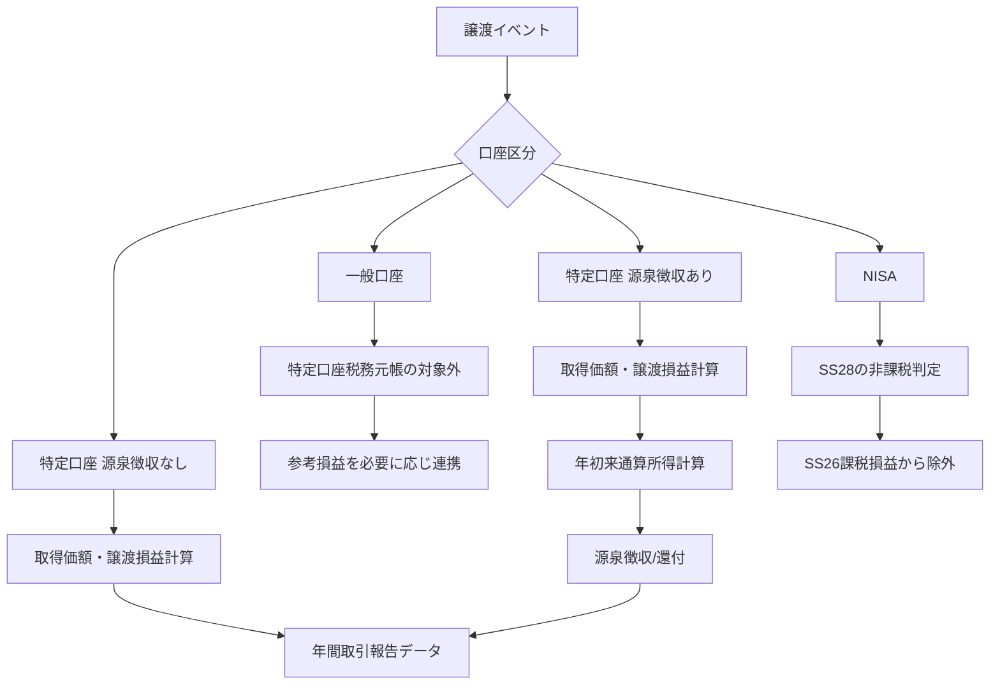
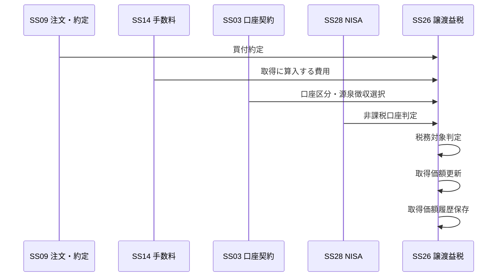
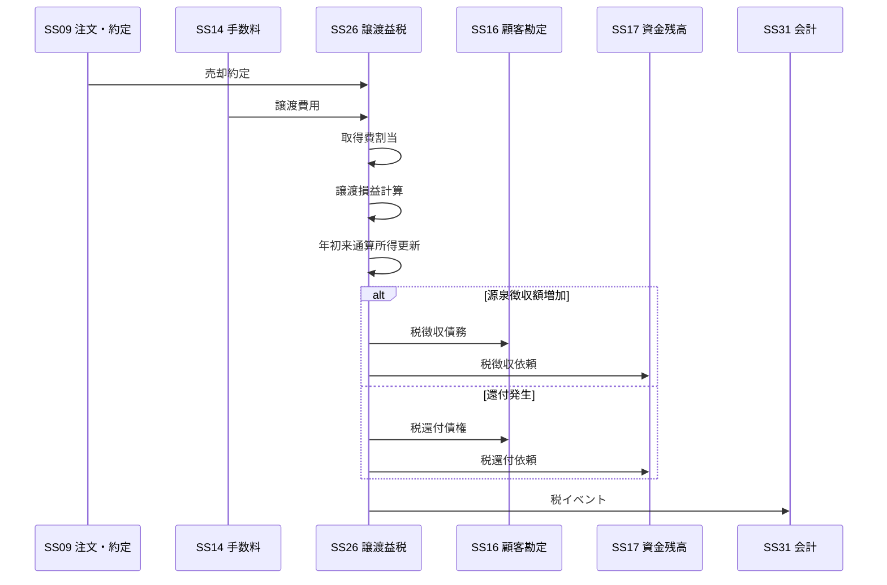
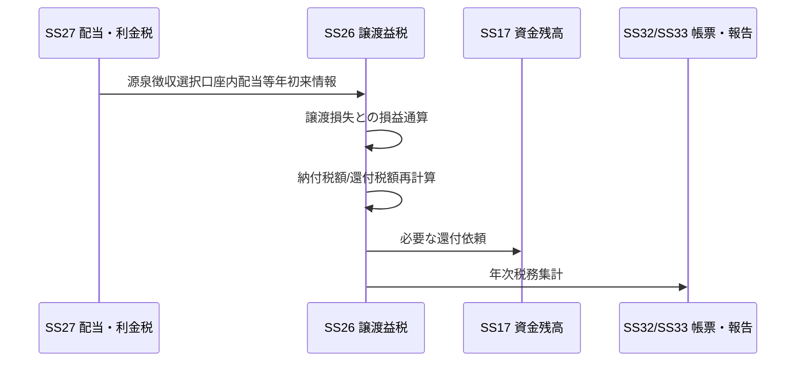

# SS26 譲渡益税・特定口座設計書

**文書種別:** サブシステム別設計書  
**サブシステムID:** SS26  
**サブシステム名:** 譲渡益税・特定口座  
**版:** 1.0  
**基準日:** 2026-09-08  
**成熟度:** 設計可能レベル  

---

## 1. 目的

本サブシステムは、証券会社における個人顧客の株式等の取得・譲渡に対し、税務上必要となる取得価額、譲渡損益、特定口座内年間損益、源泉徴収・還付、配当等との損益通算、年次税務報告データを一貫して管理する。

本サブシステムの中心責務は、**「税務上の取得価額」と「特定口座内の税務元帳」を正本として持つこと**である。

---

## 2. 責務

### 2.1 本サブシステムが正本とする情報

| 情報 | 内容 |
|---|---|
| 税務取得価額 | 特定口座における銘柄別の税務上取得価額・1単位価額 |
| 取得価額計算履歴 | 取得、移管、払出し、権利イベントによる取得価額の変動履歴 |
| 譲渡損益 | 譲渡価額－取得費－譲渡費用により計算した税務上の譲渡損益 |
| 特定口座年初来損益 | 特定口座・年単位の累計譲渡所得/損失 |
| 源泉徴収額 | 源泉徴収選択口座における所得税等・住民税の徴収額 |
| 還付額 | 後続損失や配当等との損益通算により発生した還付額 |
| 特定口座税務年度元帳 | 年間取引報告書を作るための年次税務正本 |
| 税務処理履歴 | 訂正・取消・再計算を含む税務イベント履歴 |

### 2.2 他サブシステムが正本である情報

| 情報 | 正本サブシステム |
|---|---|
| 顧客基本属性・居住性・税務属性 | SS01 顧客属性管理 |
| 口座状態 | SS02 口座管理 |
| 特定口座契約・源泉徴収選択 | SS03 契約・サービス管理 |
| 銘柄属性 | SS05 銘柄管理 |
| 税率・制度パラメータ | SS08 制度・料率・業務パラメータ管理 |
| 注文・約定 | SS09 注文・約定管理 |
| 手数料・譲渡費用 | SS14 手数料・諸経費管理 |
| 証券数量残高 | SS18 証券預り・残高管理 |
| 入出庫・他社移管 | SS19 入出庫・移管管理 |
| 権利イベント | SS25 権利管理 |
| 配当・利金税 | SS27 配当・利金税 |
| NISA口座・非課税枠 | SS28 NISA・非課税口座 |
| 会計仕訳 | SS31 会計 |
| 顧客向け帳票の生成・交付 | SS32 対客帳票・電子交付 |
| 税務署向け提出 | SS33 法定帳簿・当局/税務報告 |

---

## 3. 対象範囲

### 3.1 対象

- 上場株式等の譲渡所得等
- 特定口座
  - 源泉徴収あり
  - 源泉徴収なし
- 一般口座取引の課税区分判定・参考損益連携
- 特定口座内保管上場株式等の取得価額管理
- 信用取引等の差金決済に係る特定口座損益
- 特定口座への受入れ・払出し・他社移管と取得価額引継ぎ
- 権利イベントによる取得価額調整・みなし譲渡
- 源泉徴収選択口座内の譲渡損失と受入配当等との損益通算
- 特定口座年間取引報告書用データ
- 税率改定・帳票様式改定の有効期間管理
- 年中訂正、年跨ぎ訂正、再発行、再提出のための履歴管理

### 3.2 対象外

- NISA非課税枠・保有限度額の管理 → SS28
- 配当・利金そのものの税計算 → SS27
- 顧客の確定申告書作成 → 対象外
- 他社口座を含む顧客全体の損益通算 → 対象外
- 確定申告による3年間の繰越控除そのもの → 顧客/税務署側の処理
- 法人顧客の法人税計算 → 対象外
- 財務会計簿価・評価損益 → SS20/SS31

---

## 4. 口座区分別の基本処理



### 4.1 一般口座

一般口座では、証券会社が特定口座制度に基づく源泉徴収や特定口座年間取引報告を行わない。SS26は口座区分を判定し、特定口座税務元帳には取り込まない。

会社方針として一般口座の参考取得価額・参考損益を提供する場合は、**法定の特定口座税務元帳とは別データ区分**で保持する。

### 4.2 特定口座・源泉徴収なし

- 特定口座内の取得価額を管理する。
- 譲渡損益を年内累計する。
- 源泉徴収はしない。
- 年間取引報告書用データを作成する。
- 顧客は年間取引報告書を利用して確定申告を行うことができる。

### 4.3 特定口座・源泉徴収あり

- 特定口座内の取得価額を管理する。
- 譲渡の都度、年初来通算所得金額を再計算する。
- 当該時点までの累計課税所得が増加した場合、増加分に対して源泉徴収する。
- 当該時点までの累計課税所得が減少した場合、既徴収税額の範囲で還付する。
- 配当等受入れを選択している場合、同一源泉徴収口座内の譲渡損失と対象配当等を損益通算する。
- 顧客は口座単位で申告不要を選択できるが、他口座との通算や繰越控除等を利用する場合は確定申告が必要となる。

### 4.4 NISA

NISAの非課税判定はSS28が正本である。SS26はNISA対象取引を特定口座・一般口座の課税損益に混入させない。

NISA内の譲渡損失は課税口座の利益との損益通算対象にしない。また、NISAから課税口座へ移管される場合に適用する取得価額は、移管事由・法令に応じた値を受け取り、新たな課税口座取得価額として登録する。

---

## 5. 主要業務機能

| 機能ID | 機能 | 概要 |
|---|---|---|
| 税26-F01 | 税務対象判定 | 口座、商品、取引、居住性、NISA区分等からSS26対象可否を判定 |
| 税26-F02 | 取得価額登録 | 買付、移管、権利等による税務取得価額を登録 |
| 税26-F03 | 取得価額平均計算 | 同一銘柄について総平均法に準ずる方法で1単位価額を計算 |
| 税26-F04 | 譲渡損益計算 | 譲渡価額、取得費、譲渡費用から損益を計算 |
| 税26-F05 | 信用差損益計算 | 信用取引等の差金決済損益を特定口座内に反映 |
| 税26-F06 | 年初来通算 | 特定口座・年単位の累計損益を更新 |
| 税26-F07 | 源泉徴収 | 累計課税所得増加分に対する税額を計算・徴収依頼 |
| 税26-F08 | 税還付 | 累計課税所得減少時に既徴収税の還付額を計算 |
| 税26-F09 | 配当等損益通算 | SS27から受けた対象配当等と譲渡損失を通算 |
| 税26-F10 | 入出庫税務処理 | 特定口座への受入れ、払出し、他社移管の取得価額を処理 |
| 税26-F11 | 権利税務処理 | 分割、併合、払戻し、合併等による取得価額・みなし譲渡を処理 |
| 税26-F12 | 日次照合 | 約定・残高・Cash・税務元帳の整合を確認 |
| 税26-F13 | 年次締め | 年間損益、徴収/還付、配当通算を確定 |
| 税26-F14 | 年間取引報告データ | SS32/SS33向け法定調書データを生成 |
| 税26-F15 | 訂正再計算 | 過去取引訂正・取消・権利訂正に対して再計算 |
| 税26-F16 | 税率版管理 | 有効日付き税率・税コンポーネント・帳票版を適用 |

---

## 6. 基本業務フロー

### 6.1 現物買付



買付時には譲渡益税は発生しないが、将来の譲渡損益計算に使用する税務取得価額を確定する。

### 6.2 現物売却



### 6.3 配当等との損益通算



---

## 7. データ正本の考え方

同じ「取得価額」という名称でも、用途により正本を分離する。

```text
SS20 評価・損益
    └─ 評価簿価 / 管理損益

SS26 譲渡益税・特定口座
    └─ 税務取得価額 / 税務譲渡損益
```

税務取得価額をSS18の数量残高やSS20の評価簿価で上書きしない。

---

## 8. 主な内部接続

| 相手 | 方向 | 主なデータ |
|---|---|---|
| SS01 | 入力 | 居住性、税務属性、個人属性 |
| SS02 | 入力 | 口座状態 |
| SS03 | 入力 | 特定口座契約、源泉徴収選択、配当受入選択 |
| SS05 | 入力 | 銘柄・商品・上場株式等区分 |
| SS08 | 入力 | 税率、端数規則、制度有効期間 |
| SS09 | 入力 | 約定、訂正、取消、信用差金決済 |
| SS14 | 入力 | 取得費/譲渡費用に算入する手数料等 |
| SS18 | 入力/照合 | 証券数量、拘束、残高 |
| SS19 | 入力/出力 | 入庫、出庫、他社移管、取得価額引継ぎ |
| SS25 | 入力 | 権利イベント、基準日、払戻し、組織再編 |
| SS27 | 入力/出力 | 源泉徴収選択口座内配当等、損益通算結果 |
| SS28 | 入力 | NISA対象/課税口座移管情報 |
| SS16/17 | 出力 | 徴収/還付金額 |
| SS31 | 出力 | 税徴収/還付イベント |
| SS32 | 出力 | 顧客向け税務帳票元データ |
| SS33 | 出力 | 税務署提出用法定調書・納付集計元データ |
| CS02 | 入力 | 業務日、年次締め、再開指示 |

---

## 9. 対外接続

SS26は原則として税務署/e-Taxへ直接接続しない。

```text
SS26
  ↓ 税務データ
SS33 法定帳簿・当局/税務報告
  ↓
CS01 外部接続
  ↓
国税庁 / 税務署 / e-Tax
```

対客交付もSS32を経由する。

---

## 10. 処理時点

### オンライン/準オンライン

- 売却約定後の譲渡損益計算
- 年初来通算所得更新
- 源泉徴収/還付額計算
- 余力等に影響する税額連携

### 日次

- 約定・取消訂正取込確認
- 取得価額台帳と証券残高の数量照合
- 税徴収/還付とCash/顧客勘定照合
- 税務未処理イベント確認

### 年次

- 年間損益確定
- 配当等損益通算確定
- 源泉徴収税額/還付税額確定
- 特定口座年間取引報告書データ確定
- 税務署提出/顧客交付用データ連携

---

## 11. 設計上の重要原則

1. **税務取得価額は独立した正本とする。**
2. **特定口座内と特定口座外を同じ平均取得価額に混ぜない。**
3. **源泉徴収は1取引単独損益ではなく年初来通算所得の増減で管理する。**
4. **後続損失により過去の徴収税を還付できる構造とする。**
5. **NISA損失を課税口座損益へ流入させない。**
6. **権利イベントは取得価額に影響するため、約定だけを税務イベント源としない。**
7. **税率・帳票様式を日付付き版管理する。**
8. **訂正は過去レコードの上書きではなく、取消/反転/再計算の履歴を残す。**
9. **年次締め後の訂正に対応し、帳票再発行・税務再提出の版を保持する。**
10. **顧客交付用と税務署提出用で個人番号等の出力制御を分離する。**

---

## 12. 関連設計書

- [業務ルール一覧](./業務ルール一覧.md)
- [計算設計](./計算設計.md)
- [データ・状態設計](./データ・状態設計.md)
- [入出力・インターフェース設計](./入出力・インターフェース設計.md)
- [日次・年次処理設計](./日次・年次処理設計.md)
- [権利イベント税務影響](./権利イベント税務影響.md)
- [帳票設計](./帳票設計.md)
- [例外・訂正・再処理設計](./例外・訂正・再処理設計.md)
- [テスト観点](./テスト観点.md)
- [出典一覧](./出典一覧.md)

---

## 13. 主要出典

- 国税庁 No.1463 株式等を譲渡したときの課税
- 国税庁 No.1464 譲渡した株式等の取得費
- 国税庁 No.1466 同一銘柄を複数回購入した場合の取得費
- 国税庁 No.1476 特定口座制度
- 国税庁 令和8年版「源泉徴収のあらまし」第9
- 国税庁 特定口座年間取引報告書・記載要領（令和8年8月様式）

個別URLと適用時点は `出典一覧.md` を正本とする。