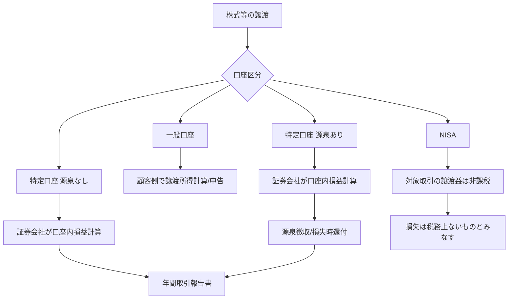
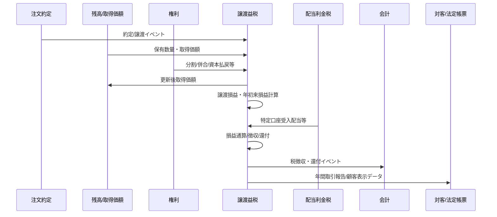

# S19 譲渡益税・特定口座

## 1. Positioning

顧客の株式等の取得・譲渡・移管・Corporate Action・配当等を受け、税務上の取得価額、譲渡所得等、特定口座内損益、源泉徴収税額/還付額、年次法定報告データを生成する。

## 2. Scope

- 個人顧客を中心とする株式等の譲渡所得
- 上場株式等 / 一般株式等の区分
- 一般口座
- 特定口座（源泉徴収あり/なし）
- 特定口座内の取得価額
- 譲渡損益
- 源泉徴収口座内の年初来損益・徴収/還付
- 源泉徴収口座への配当等受入と損益通算
- 特定口座年間取引報告書
- NISAとの境界

詳細NISAは S20、配当/利子税は S21、Corporate Actionは S17 に委譲する。

## 3. Tax Position Overview

## 4. Core Rules

### TAX-CGT-001 上場株式等の譲渡所得計算
**Rule**

`総収入金額（譲渡価額） - 必要経費（取得費 + 委託手数料等） = 上場株式等に係る譲渡所得等`

一般株式等も同じ基本式だが、上場株式等と一般株式等は別区分で計算し、損失を原則相互通算しない。

**Source**
- 国税庁 No.1463（令和8年4月1日現在法令等）
- https://www.nta.go.jp/taxes/shiraberu/taxanswer/shotoku/1463.htm

### TAX-CGT-002 現行税率（2026年所得）
所得税15%、住民税5%。所得税には復興特別所得税が付加され、源泉徴収実務では所得税等15.315% + 住民税5% = 20.315% が基準となる。

**重要な将来変更**
令和9年（2027年）1月1日以後の所得では、復興特別所得税率が2.1%から1.1%へ引下げ、防衛特別所得税（源泉徴収すべき所得税額の1%相当）が導入される。国税庁は「合計税率2.1%に変更なし、源泉徴収税額の計算方法に変更なし」と説明している。税コンポーネントは分離保持すること。

**Sources**
- https://www.nta.go.jp/taxes/shiraberu/taxanswer/shotoku/1463.htm
- 国税庁「防衛特別所得税及び復興特別所得税（源泉徴収関係）Q&A」

### TAX-CGT-003 特定口座の取得費
同一銘柄を2回以上取得した特定口座内保管上場株式等の取得費等は、**総平均法に準ずる方法**で計算する。特定口座内と特定口座外は別銘柄として扱う規定がある。

**Source**
- 国税庁 措置法37条の11の3関係 37の11の3-1
- https://www.nta.go.jp/law/tsutatsu/kobetsu/shotoku/sochiho/020624/sanrin/1273/37_11_3/01.htm

### TAX-CGT-004 特定口座（源泉徴収なし）
金融商品取引業者等が特定口座内の譲渡所得等を計算し、特定口座年間取引報告書により顧客が簡便に申告できる。

**Source**
- https://www.keisan.nta.go.jp/r7yokuaru_sp/cat2/cat21/cat219/yogosetsumei/scid2260.html

### TAX-CGT-005 特定口座（源泉徴収あり）
特定口座内で生じる所得について源泉徴収を選択した場合、口座内の上場株式等の譲渡所得は原則として確定申告不要とできる。他口座との損益通算や繰越控除を使う場合等は確定申告が必要。

**Source**
- https://www.keisan.nta.go.jp/r7yokuaru/cat2/cat21/cat219/yogosetsumei/gensenchoshukoza.html

### TAX-CGT-006 源泉口座内配当等との損益通算
源泉徴収口座に受け入れた上場株式等の利子等・配当等は、同一口座内の上場株式等の譲渡損失と一定のルールで損益通算できる。

**Source**
- 国税庁 No.1476
- https://www.nta.go.jp/taxes/shiraberu/taxanswer/shotoku/1476.htm

### TAX-CGT-007 繰越控除
一定の要件を満たす上場株式等の譲渡損失は、確定申告により翌年以後3年間、上場株式等の譲渡所得等や一定の配当所得等から繰越控除できる。これは証券会社内の源泉口座単独処理とは区別する。

**Source**
- 国税庁 No.1474
- https://www.nta.go.jp/taxes/shiraberu/taxanswer/shotoku/1474.htm

### TAX-CGT-008 NISA損失
NISA口座で取得した対象上場株式等の譲渡益は非課税。譲渡損失は税務上ないものとみなされ、特定/一般口座との損益通算や3年繰越はできない。

**Sources**
- 国税庁 No.1535
- 金融庁 NISA FAQ
- https://www.nta.go.jp/taxes/shiraberu/taxanswer/shotoku/1535.htm
- https://www.fsa.go.jp/policy/nisa2/question/index.html

## 5. Lifecycle

## 6. INPUT / OUTPUT
詳細は `input-output.md`。

## 7. Corporate Action
詳細は `corporate-action-tax-impact.md`。権利イベントはS17がAuthority、税務影響はS19がAuthority。

## 8. Reports
- 特定口座年間取引報告書
- 同合計表
- 関連する顧客向け損益/税明細
- 税務署提出用電子データ（詳細仕様は別途）

## 9. Test Viewpoints
- 同一日複数買付/売却
- 部分売却
- 手数料あり/なし
- 年初来利益→損失による還付
- 損失→後続利益による再徴収
- 配当受入あり/なし
- 特定口座内/外の混在
- 一般株式等/上場株式等の区分
- 入庫/出庫と取得価額引継ぎ
- 株式分割/併合
- 資本払戻
- NISA→課税口座移管
- 年跨ぎ
- 訂正約定/取消約定
- 2027年税コンポーネント切替

## 10. Sources
`sources.md` を参照。
