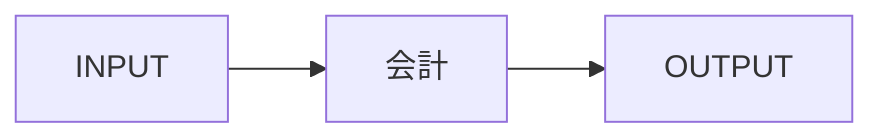

# S28 会計

## 1. Positioning
証券業務イベントから仕訳生成、GL連携、決算/管理会計を支援。

## 2. Scope
- 詳細化予定。`docs/01-architecture/SUBSYSTEM_CATALOG.md` を基準とする。

## 3. Key Business Objects
- TODO: 業務オブジェクトを列挙

## 4. Business Lifecycle

## 5. INPUT
- TODO: 項目レベルへ詳細化

## 6. OUTPUT
- TODO: データ/イベント/帳票を項目レベルへ詳細化

## 7. Internal Interfaces
S06,S13-S26,S29,S32,S34

## 8. External Interfaces
会計GL、銀行、監査

## 9. Business Rules
- TODO: Rule ID + 適用条件 + 例外 + 出典

## 10. Reports
- TODO

## 11. Batch & Timing
- TODO

## 12. Test Viewpoints
- TODO

## 13. Sources
- TODO: 一次情報優先

## 14. Maturity
`L0 Skeleton`。今後L2/L3へ詳細化する。
