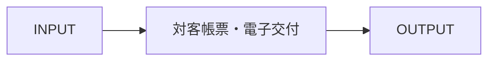

# S30 対客帳票・電子交付

## 1. Positioning
取引報告、残高報告、年間取引報告等の顧客向け文書生成/交付。

## 2. Scope
- 詳細化予定。`docs/01-architecture/SUBSYSTEM_CATALOG.md` を基準とする。

## 3. Key Business Objects
- TODO: 業務オブジェクトを列挙

## 4. Business Lifecycle

## 5. INPUT
- TODO: 項目レベルへ詳細化

## 6. OUTPUT
- TODO: データ/イベント/帳票を項目レベルへ詳細化

## 7. Internal Interfaces
S01-S24,S32,S34

## 8. External Interfaces
顧客、郵送/電子交付

## 9. Business Rules
- TODO: Rule ID + 適用条件 + 例外 + 出典

## 10. Reports
- TODO

## 11. Batch & Timing
- TODO

## 12. Test Viewpoints
- TODO

## 13. Sources
- TODO: 一次情報優先

## 14. Maturity
`L0 Skeleton`。今後L2/L3へ詳細化する。
