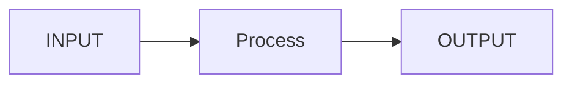

# <業務名>

## 1. Positioning
## 2. Scope
## 3. Out of Scope
## 4. Key Concepts
## 5. Business Lifecycle

## 6. Business Rules

### RULE-xxx
- Rule:
- Conditions:
- Exceptions:
- System Impact:
- Source:
- as-of:

## 7. Calculations
## 8. INPUT
## 9. OUTPUT
## 10. Internal Interfaces
## 11. External Interfaces
## 12. Reports
## 13. Exceptions
## 14. Batch & Timing
## 15. Accounting
## 16. Tax
## 17. Test Viewpoints
## 18. Sources
## 19. Open Questions
